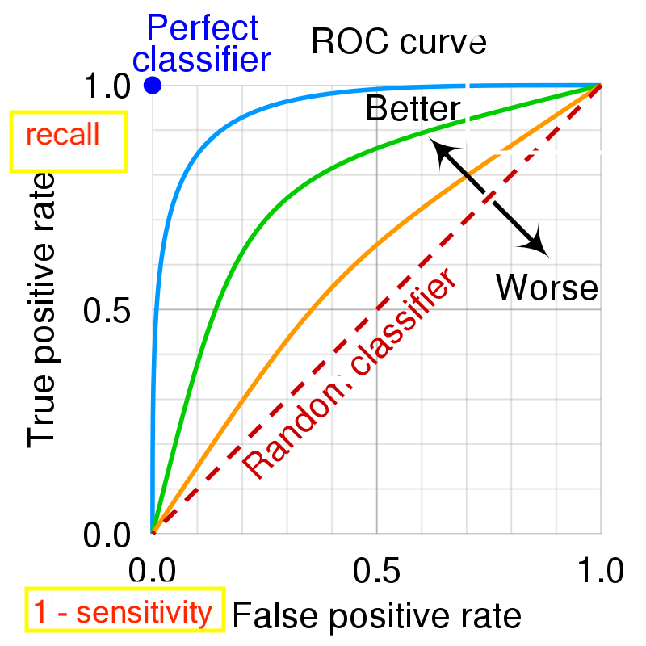
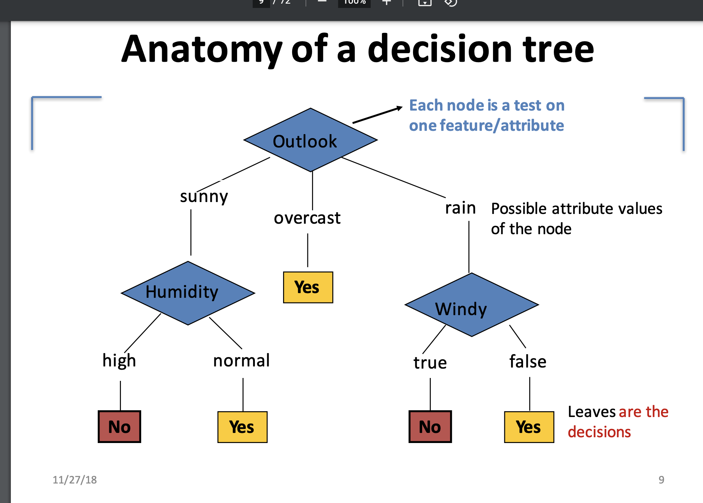
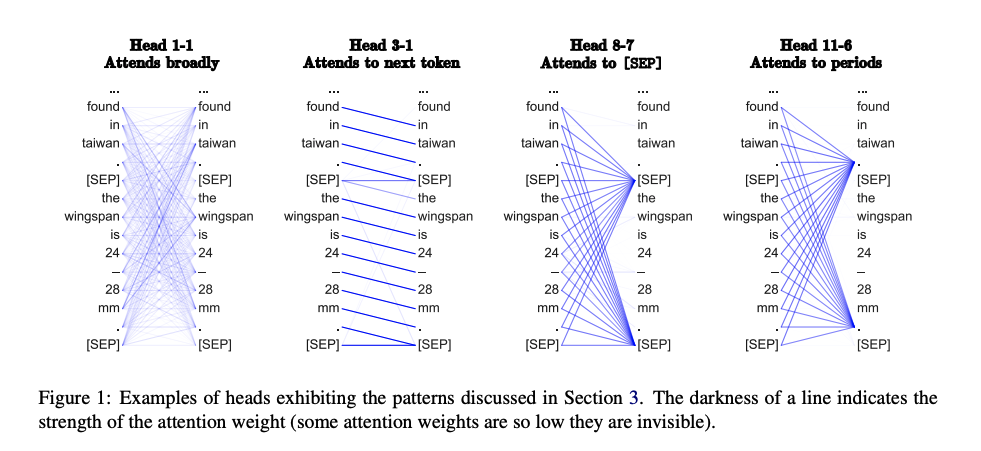

## ML Conceptual

* references:
  * https://towardsdatascience.com/data-science-interview-guide-4ee9f5dc778

## Data Exploration

* how to summarize your data?
  * 5 number summary
  * leverage `ntile()` / `avg()` / `min()` / `max()` in SQL, `summary()` in R, `.describe()` on a pandas df
  * look at its distribution, look for outliers
* how do you discover outliers in your data?
  * sort by desc, asc
* what assumptions can you make e.g. when can we say it's "normal"
* how do you detect nulls in your data?
  * R can use `is.na`, we can fill in gaps
  * `ozone_rep = airquality['Ozone'].fillna(0.0)`
  * `data.replace('?',0, inplace=True)`
  * SQL will automatically remove NULL values from aggregations, but you can some them by checking `IS NULL`
* should you replace nulls in your data? what are your options?
  * you can replace them with 0, but this could throw off average calculations
  * you could consider them to be truly null, and remove those rows from imputations down the line
    * but this could throw off your modeling performance because you're discarding an entire
  * you could replace with the median of the column
    * depends on the type of data that you are working with - in some cases, this doesn't make sense
  * you can perhaps split one column with some nulls into 2 columns that is instead a binary indicator
  * creating / filling in known as "data imputation"
  * you could replace with random samples, bounded by the lower/upper bounds of the dataset
* how do you deal with an imbalanced data set, like credit card fraud detection?
  * generate synthetic data
  * oversample the minority class when forming training / testing blocs
  * use a very sensitive cost function to artificially balance the training process
    * you can do this w/ SVM
  * use a metric besides accuracy (F1 that takes false negatives into account for example)

## Model Evaluation

### Concepts

* what is bias?
  * difference between average prediction in our model and the correct prediction
* what is variance?
  * variability of model output for a given observation
* what is the bias variance tradeoff?
  * model is too simple, can't accurately understand dataset
  * model too complex, can't generalize to new data points
* what is overfitting?
  * overfitting means a model has learned its parameters too specifically to your particular data set which means it is not going to be able to effectively generalize to unseen data
  * **high variance low bias**
    * its *Too* good at our learning problem
  * how to address?
    * regularization
    * more training data
    * parameter tuning
* what is underfitting?
  * underfitting means a model has not effectively learned parameters to model your particular data set so it is not accurately solving your problem of interest
  * **low variance high bias**
    * its not able to accurately separate our data
  * how to address?
    * more training data
    * more complex model
    * ensemble learning
  * as you increase training data, what happens to training error?
    * increases
  * as you increase training data, what should happen to test error?
    * it should decrease because we can create a model that better resembles true behavior in general senses
  * when is overfitting likely?
    * small amount of data and a large hypothesis space

### Regularization

* what is regularization?
  * L1 vs L2?
    * L1 = LASSO
      * least absolute squares
      * adds an absolute value of penalty
      * because of this, it can completely remove a coefficient by setting its value to zero
    * L2 = Ridge Regression
      * adds a squared magnitude of penalty
      * increases bias and reduces variance
  * when to use?
    * regularization prevents a single feature from being too large during model training. it can be used when you need to prevent overfitting and want your model to generalize better.
    * we would use L1 LASSO during feature selection because it can completely drop unneeded coefficients

### Metrics

#### F1, Precision, Recall

* what is F1?
  * harmonic mean of precision and recall
* what is precision?
  * true positives / true positives + false positives
  * (divide by first ROW)
* what is recall?
  * true positives / true positive + false negative
  * true positive rate
  * (divide by first COL)
* what is specificity?
  * true negatives / true negative + false positives
  * true negative rate
* why are these measures more rich than accuracy?
  * don't depend on class distribution
  * so its helpful for evaluating classifiers for rare events like cancer diagnosis

in sk learn:

```python
# Compute ROC curve and ROC area for each class
fpr = dict()
tpr = dict()
roc_auc = dict()
for i in range(n_classes):
    # where roc_curve and auc are wrapper methods to pull in appropriate data
    fpr[i], tpr[i], _ = roc_curve(y_test[:, i], y_score[:, i])
    roc_auc[i] = auc(fpr[i], tpr[i])
```

* what is a residual?
  * difference between a predicted value and a true value
* what is the ROC curve
  * receiver operating curve
  * plot recall on y axis, plot 1 - specificity as x axis
    * note 1 - specificity = "false positive rate"
  * the ROC curve is better the more area that is underneath 
    * ie we want it bending up and to the left



* What is RMSE / RMSD?
  * root mean square error / root mean square deviation
  * square root of the sum of prediction errors
  * `√(Σ(ŷi – yi)^2)) / n)`
  * on the same scale as output 

#### Error and Error Measures

* where does error come from?
  * measurement
  * random error
* What is SE?
  * standard error = variation of sample statistics
  * formula: `SE = s / sqrt(n)`
    * s - population std. dev
    * n - sample size
    * used when we have a group of random samples from a normally distributed dataset 
* What is SSE?
  * sum of squares error
  * the sum of the squared differences between the predicted data points (`ŷi`) and observed data points (`yi`)
  * `SSE = Σ(ŷi – yi)^2`
  * residuals
* What is Mean Square Error?
  * SSE divided by population size
  * `MSE = (1/n) Σ(ŷi – yi)^2`
  * "RMSE" is just the square root of this (standardizes)
* What is SSR?
  * sum of squares regression
  * the sum of the squared differences between the predicted data points (`ŷi`) and the mean of the response var (`ȳ`)
  * `SSR = Σ(ŷi – ȳ)^2`
  * the amount of variance explained by the model

## Machine Learning

* explain the difference between supervised and unsupervised learning
  * supervised learning separates data into pre-determined human defined categories based on labels
    * learn from past data in order to explain/predict new data samples
    * example: separate "fake news" from NYTimes articles
  * unsupervised learning organizes data without the use of labels.
    * example: cluster newspaper articles from the 19th century

### Models

#### K Means

* unsupervised clustering algorithm
* partitional
* globally optimal
  * exhaustively enumerates all partitions
* general alg:
  * pick a k
  * randomly initialize k-centroids
  * decide the class membership of the objects by assigning them to the nearest cluster centroid
    * with whatever distance / similarity metric you are using
  * re-estimate the *k* cluster centers
  * continue until none of the N objects switch classes between iterations
* how to pick the right K?
  * elbow finding: run with K = [1 - n]
  * and then pick the one where an "elbow" occurs and error breaks off
* objective function is intra-cluster variance

#### SVM: Support Vector Machine

* "maximum margin classifier"
* supervised
* the goal is to classify all points correctly
* a "support vector" is a data point touching the margin
* optimize by learning a boundary that leads to the largest margin between both sets of data and correctly classifies all points
* cost parameter c:
  * the larger the value, the more heavily we penalize wrong answers
  * this makes the margin between groups smaller
* we can also abstract this to higher dimensional (non-linear) spaces
* pro: 
  * creates clear margin of high separation
* con: 
  * breaks down with large or noisy data sets
  * not great with more than 2 classes
  * prone to overfitting
  * does not provide probability estimates (unlike logistic)
* test question - with 2 classes, what are the minimum number of support vectors you can have?
  * 2 - if you have 2 data points and each lies on the margin.
    * this is because when it makes the split, it does so by creating a linear margin between our data
* very good for binary classification

#### Decision Tree/Random Forest

* decision tree
  * a decision tree classifies data based on a series of one-variable decisions
  * can be used for regression or classification
  * each node is a "test"



  * the decision outcomes are found at the leaves
  * represents a *disjunction of conjunctions*
  * think of it like a big `CASE` statement

```
CASE WHEN Overlook == 'overcast' THEN tennis
CASE WHEN Outlook == 'rain' and Windy == False THEN tennis
CASE WHEN Outlook == 'sunny' and Humidity == 'normal' THEN TENNIS
END AS tennis_decision
```
  * how do we fill up the tree? what goes where?
  * alg: at each level, we want to maximize the amount of division in our data
  * ie, it's better when 8 samples go left and 8 samples go right then only 2 samples go left and 14 go right
  * one criteria: for each available var, which maximizes "information gain" and minimizes "entropy"
  * information gain = we want to increase our certainty at each step
  * entropy = a measure of purity for a data set
    * `H(X) = – Σ (p * log2 p)`
    * complete "purity" for flipping a coin - totally balanced outcomes
* decision trees are prone to over fitting because you can perfectly fit a tree for any data set
  * would just be a little weird looking..
  * relatedly, they have high variance
* random forest
  * ensemble learning technique
  * uses de-correlated trees by randomly considering which features to split with. by reducing the number of features we can split with, we reduce variance
  * relies on bootstrapping
  * high powered version is XGboost
* "loss functions" in addition to thinking about information gain / entropy, also gini coefficient (which produces a diff metric for how "pure" the nodes are)
* well suited for handling multi class

#### Linear

* linear
  * the goal of linear regression is to fit a linear model to predict unseen data points
    * predict y as a function of a linear model
    * `yˆ= f(x) = θ0 +θ1x + ....`
  * example: predict the price of a house based on its zillow description
    * input: zillow description
    * output: house price in $
    * note that what we are predicting here is *continuous*
  * task: how do we come up with our coefficients to an extended form of y = mx + b?
    * you can find a "closed form" solution by taking the gradient of the normal equation and solving
      * in some cases we just can't if matrix is not invertible
    * you can optimize a cost function, which is just something like root mean squared error, via gradient descent
      * with LR, the cost function has only one single global minimum, so this is a good choice
  * what assumptions do you make when using linear models?
    * that our data is linearly related
    * that our residuals share a fairly constant variance (homoscedasticity)
    * that outliers skew results
    * that for a fixed value of X, Y is normally distributed (gaussian)
    * residuals should be normally distributed
    * that our independent columns are not highly correlated (multicollinearity)
  * what is homoscedasticity
    * the variance of residuals is constant throughout a model
  * what are some considerations about what features to hand off to a linear model
    * two columns should not be highly linearly related
  * what is correlation(x,y)
    * cov(x,y) / [var(x) * var(y)]
    * a single outlier could either increase or decrease correlation depending on where it stands wrt the mean
  * what is ANOVA
    * analysis of variance
    * for analyzing diff bt means (not applicable for certain tasks)
* loss function - root mean squared error
* in R:

```R
house_lm <- lm(house_price ~ train_station_distance, data = real_estate)

> summary(house_lm)[[4]]
                           Estimate  Std. Error   t value      Pr(>|t|)
(Intercept)            464.47495610 6.610944493  70.25849 1.856440e-231
train_station_distance  -0.02242139 0.001211986 -18.49971  4.639825e-56

ggplot(data = real_estate, aes(x = train_station_distance, y = house_price)) + 
  geom_point(color = "red") + 
  geom_smooth(method = 'lm', formula = y(x)) +
  ggtitle("Train Station Distance and Housing Prices - linear fit") +
  xlab("Distance (ft)") + ylab("Price (USD per square foot)")

# superior to linear model!
house_log_model <- lm(house_price ~ log(train_station_distance), data=real_estate)

# confirm homoscedasticity - we want constant variance of residuals
plot(house_log_model$residuals)
# confirm normality of residuals
plot(density(house_log_model$residuals))
sd(house_lm$residuals)
```

* that log fit is a special case
* its still technically linear because we are trying to approximate the rate of change (not applying a log to the slope term) so it is still a "linear" problem
  * slope still equals rate of growth

#### Logistic

* carry out a n-class problem (could be binary, could be multi class)
* learning task: learn coefficients for p = Sb (β0 +β1x1 + ....)
  * the betas - how important each feature is to our coefficients
  * how much predictive power they have
  * initially, set weights to 0, then use MLE to optimize log odds
  * once we come up with their values, use the Sigmoid function to transform them into a distribution with values from 0 to 1.
* what is the logistic function?
  * 1 / (1 + e^-t)
* key point: logistic predicts the *probability* of outcomes, not the outcomes themselves
* also, the underlying distribution is not not normal - in this case its Bernoulli when it's a 2-label task
* math: the "odds" for an input are e raised to the weighted equation
  * `exp(coef(my_log_model))`
* R code for logistic regression:
* `logistic_model <- glm(counts ~ outcome + treatment, family = "binomial")`
* the assumptions for logistic are different than for linear
  * does not require a linear relationship bt dep. and indep
  * the residuals do not need to be normally distributed
  * it *does* assume that our observations are independent of one another
* requires a larger sample size than SVM

#### KNN

* supervised, because we know our gold standard
* non parametric method
  * can be used for either classification or regression
* with: labeled training samples, distance metric, k
* the larger the k, the lower the variance and the more smooth the boundaries are
* in practice, a tiny k like 1 is very susceptible to outliers
  * 1 green dot in a sea of red dots, could lead to issues
* algorithm:
* 1 - pick a k
* 2 - calculate distance to k nearest neighbors
* 3 - grab the votes for each label in the set k
* 4 - assign to whichever vote wins
* pro:
  * easy to implement
  * no model
* con:
  * slow
    * sooo many comparisons for a large data set and k
* no "loss" function since there's no model that we are training

#### Topic Modeling

* creates a set of probability dists over the vocab which, combined in different proportions, matches the content of the collection
* topic models are useful because they are easily interpretable, lend themselves well to visualizing
* A document typically concerns multiple topics in different proportions
  * in a document that is 10% about cats and 90% about dogs, there would probably be about 9 times more dog words than cat words.
* also, as an unsupervised method, can shed light on parts of our corpus we may have neglected
* like anything else, your results depend on your entire learning pipeline:
  * Mimno, 2016 - don't stem before topic modeling
* example of topic modeling:
  * Lucy et al 2020 textbook analysis (content of history textbooks in texas public schools)
* in software, MALLET 
  * which behind the scenes is using LDA
* setup, create a term document matrix, then probably would want tf-idf, then hand that off to model
* objective function: whatever LDA uses

#### Naive Bayes

* a generative statistical model
* can be used for classification
* why is it naive?
  * assume word usage is independent
  * thats how it's able to calculate the joint probabilities as pure multiplication
* typically, the equation is multinomial:
  * ie, like flipping a dice - count success for an event with N trials, theta success of each event, k categories
* `Pr(W1 = n1, W2 = n2... | C = c)`
* objective function: maximum likelihood estimate
* steps:
  * for each word, get its probability val in each class of documents P(word | class1), P(word | class2)...
  * multiply all vals for each class
  * compare, which ever is higher is the class that group of words should get put into
* example - what is probability of positive given the input phrase was "the pizza rocks"

```
p (positive | the pizza rocks) = 
p(the pizza rocks | positive) * p(positive) 
---
p(the pizza rocks)
```

* and we calculate p(the pizza rocks | positive) as: 
* `p(the|positive) * p(pizza|positive) * p(rocks|positive)`
* which is just a a series of frequency lookups:
  * p(the|positive) = 1 + the freq in pos texts / number of pos texts
  * (add 1 to "smooth" to prevent multiplying by 0)
* for the final check, we just compare the joint product of the positive lookups against the same values for the negative lookups

#### Neural Networks

* neural network: a learning model that uses the combination of neural units and activation functions to make non-linear decisions about inputted data
  * the activation functions provide a representation for data that can't be linearly separated
  * arc:
    * input units (scalar values)
    * hidden units
    * output units
      * should provide a normalized probability dist across possible output values
* fully-connected
  * the output of every node in layer A serves as an input to every node in layer B
* LSTM
  * network that used to be the go to for NLP problems especially machine translation
  * variant of an RNN that has "feedback layer" (as opposed to information only travelling forward through the network)
  * the LSTM cell retains its hidden state through time to provide a "memory" like mechanism
* what is back propagation?
  * the learning procedure for the weights of neural networks, by iteratively taking the gradient of the loss function
    * each node receives its parents gradient
    * computes a local gradient (gradient of its output with respect to its input) 
    * uses the chain rule to combine this with its parents and then send that to the prior layer
  * expensive process because it has to loop over every training example
* what is dropout
  * regularize the learning procedure by randomly setting the weights of nodes to 0 and removing that entire row
  * prevents overfitting
* what is the vanishing gradient problem
  * when numerous inputs result in many derivatives close to 0, the error becomes so small that it can't be used for training
  * using RelU helps because its derivative is simply 1 when x > 0
  * transformers / attention get us around this problem
* what is a (non linear) activation function
  * a non linear activation function transforms inputs to a non linear space which allows a neural network to patterns from a non linear version of the input
  * this allows it to make sophisticated decisions across boundary lines that aren't constrained by linearity
* what is sigmoid
  * maps the value z to a range between 0 and 1
  * the logistic function
* what is softmax
  * turns a vector of values into a vector of values that sum to 1
  * represent a probability dist over a discrete variable with n possible values
* what is RelU
  * maps the value of z to 0 if its negative, else return z
* what is Hyperbolic tangent
  * maps the value of z to a range between -1 and 1

### Strategies and Discussion

* very high level: describe the steps of a learning pipeline
  * task
    * define the task of your learning problem
  * data representation
    * pre-processing
    * feature extraction
    * label collection
    * operationalize / condense your area of interest into a large data set
  * scoring function
    * use a function that can accurately record your progress at the task
  * optimization and fine-tuning
  * evaluate model on unseen data
* what is gradient descent?
  * algorithm for finding the minimum of a loss function
  * iteratively adjust weights in the opposite direction of current gradient
  * stochastic gradient descent is a variation, estimates the true calculation of the gradient with a calculation from a random sample of the data set
    * should reduce training time
    * if its converging too quickly / modulating its output, reduce learning rate and increase batch size
* what is ensemble learning?
  * combining different models in order to produce more robust outcomes
  * bagging
    * bootstrap and build multiple classifiers, one for each sample, then combine classifiers
  * boosting
    * "sequential learning"
    * XGBoost
    * ADAboost
* what is a bias term?
  * bias term provides a weight-free representation of data
  * for example with linear regression, the bias term ensures that our model doesnt require points to pass through the origin
  * in neural networks, it helps move the outputs of activation functions slightl
* diff bt parametric and non parametric model?
  * a parametric model relies on underlying assumptions that a set of parameters can capture everything there is to know about the data
  * non parametric models do not rely on this assumption
  * parametric example 
    * linear regression
    * LDA topic model
  * non parametric example
    * KNN
* explain cross validation:
  * break your data into subsets, train on every piece of each subset but one member which you use as the test data, then cycle through all the subsets
  * benefits: lets us train on *all* of our data instead of just getting rid of 20% of it (with a simple train-test split)
  * also provides more performance information instead of a single metric for accuracy
  * leave one out
    * k-fold where k = dataset-size - 1
  * k-fold
    * split data into K "folds" of equal size
    * ie: 
      * divide data into 10 equal pieces
      * 9 pieces are training, 1 is test set
      * iterate over every combo and collect the scores
      * average them to see how you do
* explain grid search:
  * grid search is a method for hyper parameter optimization where you input a group of potential hyperparameters and test each version of your model
    * ie, find the best performing cost function for an SVM or learning rate for NN
* what is the curse of dimensionality?
  * bigger dims, data becomes sparse
  * and # of model configurations grows exponentially
  * more features doesn't necessarily improve performance
    * cant actually hurt performance
  * simple calc like 'distance' func becomes exponentially more difficult
* when to use classification vs regression?
  * classification separates data into camps of categorical labels
  * regression classifies based on a numerical attribute
* diff bt linear and logistic?
  * linear regression is used to separate data into classes on a continuous scale
    * uses a linear function, generalized form of w = xt + b, produces a real number value
  * logistic regression is used to separate data into categorical groups
    * uses a logistic function, the sigmoid, to estimate the *probability* of belonging to a group (bt 0 and 1)
* explain bayes theorem
  * bayes theorem lets us leverage information we know about an event to determine the probability that a conditional event we have not observed will take place
  * what is prior?
    * prior probability is some evidence we use to model an event before it takes place
  * what is posterior?
    * the probability distribution conditional on evidence from the survey, the outcome that you are after
* what is a loss function?
  * a loss function measures the ability of your model to accurately make predictions by comparing your results to their true labels
    * cross entropy loss for NNs
    * hinge loss for SVM 
  * typically described in terms of the performance on a *single* data point
* what is a cost function?
  * similar to loss function, but typically refers to the average loss of the whole training 
  * Mean Square Error
* what is an objective function?
  * most general term for the function you optimize in training
  * MLE 
  * Negative Log Likelihood 
* what is clustering
  * grouping a set of objects into similar classes
  * common form of unsupervised learning
  * "identify similar gene strands"
  * "identify similar logos at the grocery store"

## Probability

* diff bt independent and mutually exclusive?
  * two events that are independent if prior knowledge of A occurring has no bearing on B's outcome
    * P(A and B) = P(A) * P(B)
    * P(A|B) = P(A)
    * P(B|A) = P(B)
    * for example, drawing marbles but replacing them after each pull
  * two events are mutually exclusive if the occurrence of A prevents B from taking place
    * P(A or B) = P(A) + P(B)
    * P(A and B) = 0
    * for example, team A wins and team B wins
    * also referred to as disjoint
* Bayes theorem
  * P(A|B) = [P(B|A) * P(A)] / P(B)
* definition of expected value:
  * 𝐸(𝑋)=∑𝑥⋅𝑝(𝑥)
* definition of variance:
  * Var(𝑋)=∑(𝑥 - 𝐸(𝑋)^2) / n
* how to get probability w/ Binomial Distribution
  * (N choose x)(p)^x (1-p)^ n-x
  * prob that world series goes to seven games:
  * 6 Choose 3 * .5^3 * .5^3
* license plate problem
  * 3 letters, 4 numbers = 26^3 * 10^4
* loose def of probability: long term expected chance of an event
  * number of ways it can happen / total events in sample space
* roll 3 die, probability all 3 dice have different top numbers
  * (6 * 5 * 4) / 6^3
* number of ways that 3 rolled dice can have their tops be at least 16
  * = p(sum is 18) + p(sum is 17) + p(sum is 16) all over 6^3
  * p(sum is 18) is only 1 possibility, so that's (1/216)
  * p(sum is 17) is 3 possibilities, so that's (3/216)
  * p(sum is 16) is 6 possibilities, so that's (6/216)
  * add together, 10/216 reduces to 5/108
* 

## Linear

* operations:
  * tranpose: flip rows and columns
  * multiply matrices: every row by every column when inner dims of A and B match
  * (2x3) x (3x2) => 2x2 matrix
  * addition/subtraction: element wise, dimensions must match
* dot product: multiply everything element-wise
  * produces a scalar
  * also known as "inner product"
  * `a = [1,2,3], b = [4,5,6], a ● b = 1*4 + 2*5 + 3*6 = 28`
* `y = Ax` => `yT = xTA `
  * `yT` is a linear combination of the rows of `A`
* magnitude: square root of the sum of its squares
  * ie `sqrt(a1^2 + a2^2 + ... an^2)`
  * mag of a is |a|
  * this means that `a / |a|` gives us a "unit vector" (of length 1)
  * this is the L2 Norm
  * (where the L1 norm is the "manhattan" distance (sum of its absolute values))
* orthogonal, when `x ● y = 0`
* matrix is orthogonal if its inverse = its transpose
  * best case ....
* an inverse matrix is analogous to a reciprocal in scalar-world
  * A x A^-1 = I = A ^-1 * A
  * much like 6 * 6^-1 = 1
  * recall the identity matrix I is 1's down the diagonal
  * a matrix that has a valid inverse is called *nonsingular*
* when is a matrix invertible (ie nonsingular)?
  * when it is square and:
  * when determinant of A is not 0!
  * det of 2x2 is a11a22 - a21a12 and it gets fuzzier from ther
    * remember the checkerboard thing + flipping signs
* what is linear independence:
  * when a set of vectors cannot be written as a linear combination of one another
  * the only solution to setting them up as a system Ax = y is 0.
  * every column in a matrix A  has to be linearly independent if A is invertible.
* what is an eigenvector
  * makes this equation true
  * Av = λv results in a vector U that points in the same direction as v
  * where λ is the eigenvalue, the "scaling" factor
  * does not change direction during a transformation
  * a matrix can only have eigenvectors when it is invertible aka linearly independent
  * once this is the case, we can generate an infinite number of eigenvectors (numbers) / eignevalues (scaling coeff.)
  * 

## Helpful Calculus

* derivative: `f'(x)` = slope of the curve f(x) 
  * typically at point x
  * *rate of change*
* chain rule:
  * `h(x) = f(g(x))` => `h'(x) = f'(g(x)) * g'(x)`
* multiplication:
  * `h(x) = f(x)g(x)` => `h'(x) = f'(x)g(x) + f(x)g'(x)`
* division:
  * `h(x) = f(x) / g(x)` => `h'(x) = [f'(x)g(x) - f(x)g'(x)] / (g(x)^2)`
* eulers:
  * `h(x) = e^x` => `h'(x) = e^x`
* log:
  * `h(x) = log(x)` => `h'(x) = 1/x`
* a gradient simply provides partial derivatives for particular spots in a matrix
  * let `f(x, z)`
  * `g` = `∇f` =  `{∂f/∂x, ∂f/∂z}`
* integral: `∫f(x)` = area under a curve f(x) 
  * typically (from a to b)
  * *amount of accumulation*

## Random Math

* Revenue is 2017 was 100. This was an 8% increase from 2016. What was the 2016 revenue?
  * ask yourself, 100 is 8% bigger than what number?
  * 1.08 * 100 = x => x = 100 / 1.08 = 92.59
* 

## Statistics

### Sampling

* what is the central limit theorem?
  * if you draw large, random samples from a populations, the means of those samples will be distributed normally around the population mean
  * you can game this out by noting the variance of the sample mean drops to 0 as the number of samples becomes very large
  * for example, 1000 fair coin flips can be modeled by a normal dist N~(500, 250)
  * thanks to CLT we *know* the population mean just from taking a large enough sample
* what is the law of large numbers?
  * sample mean gets closer to the expected value as sample size increases
  * ie, as we flip a coin, more and more, the observed p(heads) will get closer to p(tails)
  * and approach true val of p(heads) = p(tails)
* why do we sample?
* what is bootstrapping?
  * iteratively resampling your dataset in order to estimate population metrics
  * when to use it?
    * very useful when you have a constrained/limited sized dataset but still want to carry out advanced analysis

### Hypothesis Testing

#### Procedure

* give me the steps for doing a hypothesis test:

* 1. state the hypothesis
  * begin by stating a null hypothesis, which you presume is true
    * just like "innocent until proven guilty"
  * next, come up with an alternative hypothesis
    * can be two tailed - bidirectional !=
    * or > / <
* 2. set a level of significance for the test
  * this is the criteria for our decision
  * in words: when the probability of obtaining a sample mean as what we have observed is less than alpha percent if the null were true, we reject the null hypothesis
  * why? it is likely that sample means that fall in the extreme parts of the tails occur for a population mean when the null hypothesis is false
* 3. compute the **test statistic**
  * tells us how many standard deviations a sample mean is from the population mean
  * the larger the value of the test statistic, the further the distance a sample mean is from the population mean stated in the null hypothesis
* 4. make a decision
  * compute a **p value**
    * the probability of obtaining a sample mean given the value stated in the null hypothesis is TRUE
      * note that for a 2 tailed test, p is found w/: `2 * (1 - Φ(test_statistic))`
    * between 0 and 1, never negative
    * reject when the CALCULATED p < alpha
    * *the base p value IS = to alpha*
    * so in code it's like
    * `my_p_val < sig_level` 
      * (two tailed --> sig_level / 2)
* python code:

```python
t_statistic = abs(avg_diff / standard_error)
# in this case, break in two (ie go from 97.5 -> 100)
t_at_sig = stats.t.ppf(1 - (alpha/2), sample_size)
dof = sample_size - 1
# in this case, double it because two tailed test
p_val = 2 * (1 - stats.t.cdf(t_statistic, df))
return bool(p_val, sig)
```

* when to use a binomial test
  * when we have very few samples of a Bernoulli trial
    * / proportions
* when to use a z-test
  * used when we know the population variance, and sample size is >= 30 (CLT)
* when to use a t-test
  * used when we do not know the population variance, and sample size is >= 30 (CLT), and our samples are normally distributed
* compare t-distribution to normal-distribution
  * t-dist is more spread out
  * used we don't know standard dev
  * produces wider confidence intervals than z-dist 
    * (for small-ish sample sizes)
* which t-test do i use?
  * one-sample should be used to compare the *mean* of 1 sample to a *known* value
  * two-sample should be used to compare *two* means from *two* samples
    * if equal sample sizes and equal variances (assumed): common population error pooling
    * if not: welch's t test - https://en.wikipedia.org/wiki/Welch%27s_t-test
* how to calculate a z score?
  * when **X** is a single random variable and we are pulling from a dist:
  * `z = (x-μ)/σ`
  * when we are *sampling*, we are randomly drawing variables from some distribution `~N(μ, σ)`
  * this new distribution will have the same mean, but a different variance
  * so, a z score from a *sample distribution* `~~N(μ, σ^2/n)` is:
  * `z = (𝑋-μ)/(σ/√𝑛)`
  * remember that the point of the z score is to give us a *standardized* score
    * that's why we have that denominator change -- we are taking the square root of all of `σ^2/n`, as thats our variance, and square root of variance is standard dev
* how to calculate a t score?
  * general form: sample differences / standard error
  * one sample t test:
    * `t = (𝑋- μ)/(s/√𝑛)`
    * where 𝑋 is the sample mean
    * where s is the *sample* standard dev
  * two sample t test:
    * `t = (𝑋1 - X2) / [standard error]`
* how to determine significance?
  * is the calculated p value smaller than the significance level
  * if so, reject null hypothesis
* how to calculate area of acceptance from sig level
  * the area of acceptance is just everything to the left of the critical value

#### Hypothesis Testing Conceptual

* what is a critical value
  * the threshold that - if exceeded - leads to the conclusion that the difference between the sample mean and the (hypothesized) population mean is large enough to reject the null hypothesis
  * = to value whose probability of occurrence is <= alpha
    * note that you might have to adjust if you have a 2 tailed test
  * popular critical value: alpha is .05, z = 1.96
* what is type I
  * type I error is a false positive
  * the error of rejecting the null hypothesis when it is true
  * ie, we accept an alternative hypothesis even though it can be attributed to chance!
  * its probability is Alpha
  * (telling a man he is pregnant)
  * (in NER - label a person entity as a place)
* what is type II
  * type II error is a false negative
  * when we fail to reject the null hypothesis when it is false
  * ie, we fail to observe a statistical difference when there is one!
  * (telling a quite-pregnant woman she is not pregnant)
  * (in NER - missing the fact that Paris is a city in France)
  * probability is Beta
* what is statistical power
  * the probability of *not* making a type II error, of failing to accept the alternative hypothesis when there is enough evidence to accept it is not occurring by random chance
    * 1 - Beta
* what is a significance level
  * the significance level represents the probability of rejecting the null hypothesis when it is true
* what is a confidence interval?
  * gives us a measure of how confident we are that the statistic of interest falls in that interval 
  * x% of confidence intervals we generate will capture the true value of the population mean
  * we are x% confident in the process used to generate our interval
  * the true population mean lies within the computed interval 95% of the time ("in the long run"). 
  * how to calculate?
  * (sample mean) +/- margin of error
* what is margin of error?
  * critical val * standard deviation/error
    * where critical value is z-score at sig level!
      * ie, the z score corresponding to a "p val" of .05
    * standard dev or standard error depending on what you are working with
* what is a p-value?
  * the probability of obtaining the observed sample mean given the value stated in the null hypothesis is TRUE. 
  * The probability that, *in the long run*, the null hypothesis remains accurate (which will never be 0 just because of how things work out). 
  * When it is sufficiently small - less than alpha -- we *reject* the null and adopt the alternative explanation.
  * the amount of area not covered by the accumulation of the dist wrt the retrieved test statistic
    * the remaining area!
* what is A/B testing
  * A/B testing is just another way of setting up a hypothesis test.
  * average revenue per user, Gaussian
  * `t.test(data1, data2, var.equal=TRUE)	`
  * use a z-test, t-test, depending on the information you have about your samples
  * most of the time we're not going to know the population standard deviation because this is real-world data
  * so the t test comes in handy for those situations
* what are degrees of freedom
  * number of independent pieces of info
  * typically, N-1
* 68–95–99.7 rule:
  * 68% of vals are within 1 SD of the mean
  * 95% of vals are within 2 SD of the mean
  * 99.7% of vals are within 3 SD of the mean

## NLP

* type
  * a unique a word in a vocabulary
* token
  * an instance of a word in a vocabulary
* type token ratio for "The big dog is red and the small dog is blue"
  * types: 8
  * tokens: 11
  * ttr - 8/11
* what is stemming?
  * stemming removes the ends of words with the goal of reducing inflectional diversity
  * porter stemmer, most common
    * turns `operate operating operates operation operative operatives operational` into `oper`
    * but then we lose the concept of an "operating system"
  * increases recall, reduces precision
* what is lemmatization?
  * lemmatization has a similar goal, but uses a morphological analysis to inform its decision making with the goal of returning the "dictionary" form of a word
    * `seeing seen sees` -> `see`
* what is named entity recognition?
  * a specific kind of coreference resolution where we resolve the named entities used in a text
  * captures the task of, can we extract *who* a text is talking about
  * different sub tasks, like identifying corefers and anaphors
  * extremely complicated
  * in python: SpaCY
  * this is an area that relies on hand-annotated gold-standard data
    * wow, at yext, they hand annotate tons of queries
  * neural models combine previous syntax/rule-based methods with other solutions
  * at yext:
    * 1 - extract entities
    * 2 - look up against clients Knowledge base
    * 3 - serve relevant results
    * to answer a question like "branch in pittsburg, pa"
  * question - is the thumbs down granular enough feedback for retraining on a mistake?
* what is coreference resolution?
  * disambiguation, rather than just entity extraction (what NER provides)
  * for example, can i figure out what objects or events a text is talking about
* what is tf-idf
  * term frequency inverse document frequency
  * a measure of lexical richness that can be used to see what words are the most characteristic of a particular document in a corpus
  * calculation steps:
    * 1 - capture the vocabulary of the corpus
    * 2 - array the documents as rows, every possible word as columns
    * 3 - for every word in the vocabulary
      * - count how many times it is in document D
      * - count how many total documents it appears in
      * the term-frequency per doc is how many times it is in D / how many total words are in D
      * document frequency is: total number of documents / [how many documents it appears in + 1]
        * we add zero to the denom so we don't divide by 0
      * accumulate this as tf-idf w/ : tf * log(df)
    * 4 - assemble these numbers at document D for every word in Vocab
  * once we have these metrics, we can carry out exercises like for example making an embedding for each word by slicing it up and making a vector for each word
* what is dependency parsing?
  * modeling the syntactic structure of a sentence by analyzing the grammatical relationships between the words in a sentence
  * for example in `rainy day`, rainy is an adjectival modifier for day
  * provides a "hierarchy" of children / ancestors
* what is a language model?
  * provide a way to quantify the probability of a sequence of text occurring
  * "operationalize the fluency" of an input sequence
  * `P(w1 = “call”, w2 = “me”, w3 = “Ishmael”) x P(STOP)`
* when would you want to keep stop words?
  * in certain applications like coreference resolution or part of speech tagging, stop words could be very important
  * for example we would want to keep determiners like 'an' 
* explain word embeddings.
  * word embeddings rely on the distributional hypothesis: words that occur in similar contexts have similar meaning
  * they serve as the initial input to many modern NLP solutions
  * we prefer *dense* vectors rather than simply the solutions generated from tf-df
    * less params more efficient and avoids overfitting
  * word2vec = skipgram, static embedding for each word
  * GLoVE combines word2vec and pointwise mutual info
  * cool applications - two words most "similar" when their cosine similarity is very small.
    * `v • w  / (len(v) * len(w))`
  * you could imagine making a "document" vector computing an average of embeddings
* what is chi squared
  * tests whether there is a statistically significant difference between observed and expected frequencies
  * for NLP: could use chi squared on tf-idf scores
* why is BERT so good?
  * word piece (plus [CLS] and [SEP])
  * pre-training
  * bidirectional
    * consider every other token in a sequence to predict word w
  * masking
    * randomly blank out certain tokens to prevent overfitting and increase understanding
  * next sentence prediction
  * multi-headed attention
    * split rep into query, kev, and value (with linear transform)
    * 12 per layer
  * transformers
  * fine-tuning
    * domain specific adaptation w/ your own dataset, objective function and parameter tuning
  * open source
* why is GPT so good?
  * huge pool of params + data
  * byte pair encoding
  * no need to fine tune (zero/few shot)
  * transformers
* how do you reduce dimensionality of textual data?
    * PCA
      * transform data to a new coordinate system
      * axis 1 = greatest variance (by projection), axis 2 = second greatest, etc.
      * each of these levels is a "principal component"
    * LSA
      * matrix decomposition
      * removing unneeded columns
* what is one hot encoding
  * one hot encoding is an extremely simple way to represent the words in a vocabulary
  * makes V x V size matrix, and place a 1 at slots xi = ji.
  * in this way, we can use this matrix as a lookup table for that words embedding information in a matrix filled w/ embedding info because one-hot @ "candy" dot embedding_matrix will hand us back the embedding for candy
* compare and contrast BERT and GPT-3
  * BERT - devlin et al 2019
  * GPT3 - brown et al 2020
  * BERT is bidirectional, GPT is left to right
  * BERT uses word piece tokenization, GPT uses byte pair encoding
  * GPT has far more parameters than BERT
  * GPT-3 was trained on common crawl, web text, *some* book corpus, a little reddit
  * BERT was trained on bookcorpus + wikipedia
  * GPT-3 is very ease to use with zero/few shot learning for all downstream tasks
  * BERT requires separate data / stage for fine-tuning for tasks like machine translation, part of speech tagging
  * BERT trains with masked language modeling and next sentence prediction
  * GPT-3 trains with an encoder/decoder model, next word prediction
    * directly compute P(w | its preceding words)
  * BERT encoder only, just hands off information that you can decode during your specific task
  * BERT is open sourced, GPT3 still under wraps
  * BERTology is pretty cool, harder to do w/ GPT3
  * GPT-3 is especially good at text generation
* what is attention
  * basic idea, we have word embeddings, and want to come up with a classification result of documents
  * attention allows us to provide and manipulate *weights* when we carry out calculations with word embeddings
  * therefore highlighting more discriminatory elements of a document
  * serves as more parameters for the model!
  * BERT scales it way, way up
    * https://nlp.stanford.edu/pubs/clark2019what.pdf



* explain how a transformer works
  * multiple layers + multiple attention heads
  * easily share information regarding far-away tokens
    * like an improved sharing scheme (LSTM)
  * encoder-decoder arc.
* you just created an NLP model. what are some ways you can see how well it performs?
  * mixture of standard error / recall measures (accuracy, F1, ROC) and task specific like the stanford question and answer data set (SQuAD) and general language understanding eval (GLUE)
  * you should also try to look at how efficient it is 
    * - how many parameters have you added versus baseline? 
    * is there a significant gain for x amt of increase in training time / corpus size?
      * if it takes 2 weeks to train your model, it's going to be hard to iteratively retrain it with new data
  * also, can it generalize? can it be applied to other tasks>
* what is zero-shot learning?
  * leveraging a language model by directly running test cases w/ no "fine-tuning" / domain-specific training
* what is prompt-based learning?
  * using the same style of question and answer learning that language models often use in their training phase when you are going through your task of interest
  * adjusting your objective like sentiment analysis of part of speech tagging to be solvable via "prompts"
    * masking, permutation, english + non-english pairings, NER
* sig testing in NLP, why do we have to be careful?
  * don't use a t-test if we aren't working with an average measure
  * don't assume data is iid
    * (text data from same author is not independent)
  * mixing k fold and significance tests
    * you need to be calculating a p-val / checking null hypoth for each fold
  * using a t-test for classification
    * there are better tests for this
  
## Resume

* Work
  * ETL for Janes?
    * transformed CMS data (Rich text, particularly) from roughly HTML/JSON to XML
    * added metadata / other info from external APIs
    * DITA compliant
    * then dropped in s3
  * Product Ingestion?
    * take products from salesforce, transform from XML to java objects, commit to CMS
    * sync between ingested and in CMS
    * automatic
    * asynchronous
  * Tools / what did i work with
    * stack: 
      * Java
        * modeling, api integrations, data ingestion
        * model view view model ~ MVC
      * MySQL - data migration
      * json: data contracts
      * hbs: front-end templates
      * less/js for FE (didn't really touch)
    * tech: 
      * Docker
        * containers for mysql, solr, tomcat
        * easy to get client devs on board
      * Travis -> github actions
        * CI/CD
      * EC2
        * production code / releases
      * S3
        * data / data movement
      * Jira
        * tickets
* Thesis
  * tokenization?
    * word, sentence, paragraph
    * by hand, rules based / regex
    * probably should have used a package, there
  * feature engineering
    * 31 features like, punctuation per line, syllables per word, etc
  * Decision Trees
    * used random forests for feature selection via the variable importance metric
    * a random forest was used because ensemble learning is an effective way to combine the output of many decision trees
      * random forest uses decorrelated trees to expose clearer insights in our data
      * prevents overfitting
    * most important features: freq of "perception" words (from harvard inquirer), amount of times the word "i" appears, and the freq of consecutive sentences starting with the same word
      ```R
          m <- randomForest(new_df[,-31], new_df$label2, 
                        sampsize = round(0.8*(length(new_df$label2))),ntree = 500, 
                        mtry = sqrt(30), importance = TRUE)
      ```
  * SVM
    * used SVM with the most important features from random forest ...
    * had just learned that in class, wanted a *binary* separation of my data
      * used LOOCV since I had a pretty small data set
      * In 42 out of 50 trials, the test novel was placed in its true class. 
      * This is where that 84% accuracy comes from.
      * According to my classifier, novels with high levels of anaphora and low levels of perception belong in the “lyrical” class. 
      ```R
      folds <- cvFolds(NROW(sub), K=50)
      results <- c(0)
      names <- c(0)
      for(i in seq(1, 50)){
        # run LOOCV each time 50 times and see what the average accuracy is. 
        
        train_temp <- sub[folds$subsets[folds$which != i], ] #Set the training set

        test_temp <- sub[folds$subsets[folds$which == i], ] 

        temp_fit <- svm(label2 ~., data = train_temp, kernel = "linear",
                      cost = 1)
        test_grid_temp <- predict(temp_fit, newdata = test_temp)

        mat <- confusionMatrix(test_grid_temp, test_temp$label2)
        if(mat$overall[1] != 1){
          print(i)
          names <- append(names, big_boy[i,1])
        }
        results<-append(results, mat$overall[1])
      }
      ```

  * graphing?
    * created plots using ggplot2 and matplotlib
    ```python
    for i,x in enumerate(container):
        row = np.array(x)
        row = row.astype(float)
        y = np.arange(1, len(row)+1, 1)
        plt.figure(figsize=(9,9))

        plt.plot(y, row)
        plt.title(titles[i])

        plt.savefig(titles[i] + '_MATTR.png', dpi=500)
        plt.gcf().clear()
        plt.show()
    ```

* Research
  * logistic
    * predicting case outcomes?
    * realized that this wasn't quite the level of analysis we wanted to work on
  * named entity recognition
    * try to distinguish which parties were being references in cases
    * was my first attempt at using spacy
  * topic modeling
    * mallet
    * this was a very cool introduction to NLP - first thing I helped work on
    * my job was to produce mallet runs for our corpus and carry out interpretation
    * we also used d3 to create a very cool topic visualization - linking cases that share topics and making the links more defined when their shared prob was higher
  * metadata work
    * figuring out questions like, given a date, return who was on the court / who was chief justice
  * overall, i really liked the problems the team got to work on
  * but, i think in this sort of academic setting, the project planning aspect does not get as much attention as it should
    * as boring as it is in the real world, i think that we would have benefitted from some more "structural" meetings instead of just doing weekly check ins 
* GPT-2 (SBOTUS)
  * interested in using court corpus to make a "bot" for each justice
  * did not have enough data to do this reliably, though, so just made one "composite" justice model
  * added extra data by using the Oyez API 
    * for each case, pull in the oral arguments for each participating justice
    * this left me with a huge amount of data for each justice - all their sentences
  * for gpt-2 itself, for the repo and fixed the tensor flow version (was not compiling)
  * and then wrote a google collab notebook to fine tune the model with my data
  * the generated aphorisms were ok, but i think it just needed a lot more of my specific data
  * it might be interesting to repeat it w/ zero shot gpt3
* Twitter BOT
  * after reading the hard copy of the washington post at my parents house, became fascinated w/ bezos disclosures
  * use news api to get a link to every article that contains his name
  * run through the text and search for the disclosure with regex
  * tweet that out via a google cloud function, run automatically with a cron job
* NLP project
  * i've become very interested with the way that different authors use details
  * there have been some cool papers recently that use neural networks to classify text passages based on how important they are for the plot
  * i sort of want to do the opposite
  * right now, i'm actually hand annotating a large set of passages on my own and then i'm going to look for commonalities in the data/tags
  * from there, i hopefully can adopt a cool classification method
  * i would love to get an interpretability method like LIME going to this end
* Classes?
  * applied NLP, favorite class right now
  * also taking a stats course - half experimental design, half stats
  * next semester, hopefully TA, as well as explore a CS dept course like intro to AI

## Current, Interesting Papers

* wilmot and keller, 2021
  * Memory and Knowledge Augmented Language Models for Inferring Salience in Long-Form Stories
  * http://arxiv.org/abs/2109.03754
  * salience detection with RAG
* bender et al, 2021
  * Stochastic Parrots
  * https://dl.acm.org/doi/pdf/10.1145/3442188.3445922
  * are lang models too big?