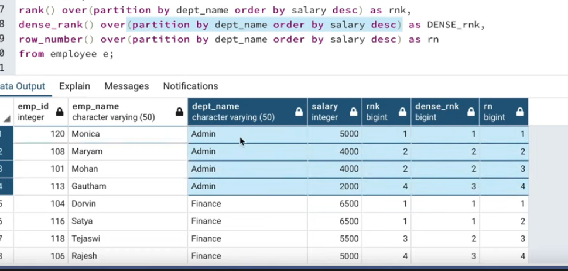

# SQL NOTES

SQL - Structured Query Language. Used to construct and maintain databases at scale.

A database is a group of tables.

## SELECT and FROM

Two most basic SQL ingredients. 

`SELECT` indicates which columns you'd like to view.

`FROM` identifies the `table` they live in.

```
SELECT year, artist, album FROM spotify.playlist
```

You'll need to prefix the database name at the end 

```
SELECT year, month, month_name, south, west, midwest, northeast FROM tutorial.us_housing_units
```

## AS - Aliases

Used for renaming results in the display view.

Everything that needs to be contiguous should use underscores. 

If you really need a separate string, like "West Region" you need to explicitly add quotation marks. 

Same goes for if you want capital letters, otherwise everything will be lowercase. (This is usually fine)

```
SELECT west AS "West Region"
  FROM tutorial.us_housing_units
```

Without this alias, the following query would have a very verbose label as its column name.

```
SELECT
   CONCAT_WS(', ', lastName, firstname) AS "Full Name"
FROM
   employees;
```

Note that the `as` keyword itself is actually optional in that if you don't put it MySQL will still do the cleanup for you. Works for column names and the table.

Sometimes you're going to have to have an alias because 2 tables could have the same column name.

i.e. 

```
SELECT
	customerName,
	COUNT(o.orderNumber) total
FROM customers c INNER JOIN orders o ON c.customerNumber = o.customerNumber
GROUP BY
	customerName
ORDER BY
	total DESC;
```    

One catch with aliases is that you can't used an alias column again in the same SELECT statement.

```
SELECT year, month, south / (south + west + midwest + northeast) AS south_pct FROM tutorial.us_housing_units
```
For instance here, i can't just save the bottom portion as `total` and then use it again and again, it has to be continuously recalculated (at least without the use of a sub query).

## LIMIT 

Placed at the end of a query to cull the number of results returned.

## WHERE - Filtering Data

Used to filter the particular rows handed back by the query. 

Ordering... `SELECT`, then `FROM`, then `WHERE`. Entire rows of data are filtered out, together, so if you add a condition and a row doesn't meet it, all of its columns are removed from the result set. 

### Comparison Operators

Equals: `=`

Not Equal: `<>` / `!=`

Greater Than + equal to: `>=`

Less Than + equal to: `<=`

```
SELECT *
  FROM tutorial.us_housing_units
 WHERE west > 30
```

For comparisons on nun-numerical data, you can use single quotes.

```
SELECT * from tutorial.us_housing_units
WHERE month != 'January'
```

### Simple Math

You can do direct, across column operations with operators like `+` and `-`.

```
SELECT west, midwest, northeast, midwest + northeast AS midwest_and_northeast FROM tutorial.us_housing_units
LIMIT 10
```

You can even do this sort of combining directly in the where clause:

```
SELECT west, midwest + northeast as midwest_and_northeast
FROM tutorial.us_housing_units
WHERE west > midwest + northeast
```

More advanced aggregation methods to come (ie to calculate averages and things like that).

## Logical Operators - allow you to use multiple comparisons in a single query

### `LIKE`

Let's you match on character similarity using string format notation. 

### `Wilcards`:
*   The percent (%) matches any string of zero or more characters.
    *   `s%` matches sa, six, sunk.
*   The underscore (_) matches any *single* character. 
    *   `se_` matches sea and set because they have an `e` in position 2 and then something else in position 3. 
* The underscore is essentially used to enforce a minimum length. 
* If you just use the percent sign, you could get a match back for just what's to the left of the pct in `LIKE t%` (i.e. someone is just named 't' in the DB.).

For a case insenstive `LIKE`, use `ILIKE`. (Not sure why you'd want this).

Return all data for years where one of the groups had Ludacris in it.

```
SELECT * FROM tutorial.billboard_top_100_year_end
WHERE "group" LIKE '%Ludacris%'
```

Return all data for years where a "DJ" is at the lead of the group

```
SELECT * FROM tutorial.billboard_top_100_year_end WHERE "group" like 'DJ_%'
```
(ie, must be DJ SOMETHING not just an artist named DJ).

Select all records where the second letter of the City is an "a".


```
SELECT * FROM Customers
WHERE City LIKE '_a%'
```

There are some other reserved classes, like 

[abc] is a contigous group so LIKE '[ldn]%' means starting with l or d or n.

This can also be achieved with `IN`....

### `IN`

Specify a list of values you'd like to include in the results.

i.e. 

`year_digit IN (1, 2, 3)`

or 

```
"artist" in ('M.C. Hammer', 'Hammer', 'Elvis Presley')
```

### `BETWEEN`

Between works to select rows in a specific range. It can also be replaced by using `AND` - its a little more compact. 

Note: the command is *Inclusive* at its bounds ie `BETWEEN 5 and 10` will contain rows at the margins.


### `IS NULl`

Used to exclude rows that contain missing entries.

`SELECT * from houses where tax_status IS NULL`

### `AND`

Used to combine operations - rows must satisfy the conditions on both sides of the clause.

A chain of `AND`'s:
```
SELECT *
  FROM tutorial.billboard_top_100_year_end
 WHERE year = 2012
   AND year_rank <= 10
   AND "group" ILIKE '%feat%'
```

Top ranked song of 1990, 2000, 2010
```
SELECT *
  FROM tutorial.billboard_top_100_year_end
 WHERE year_rank = 1
   AND year IN (1990, 2000, 2010)
```   

### `OR`

Select rows that satisfy either of two conditions. Much like AND, it can be chained with a group of conditions.

Combine via parenthesis.

Write a query that returns all rows for top-10 songs that featured either Katy Perry or Bon Jovi.

```
SELECT * from tutorial.billboard_top_100_year_end
WHERE 
(year_rank BETWEEN 1 and 10)
AND ("group" ilike '%katy perry%' OR "group" ilike '%bon jovi%')
```

Note how pushing those wildcards on the outside lets us hit both a song directly by Katy Perry or a song she's featured in that contains other artists.

And with the combination, the OR needs to be satisfied as its own separate statement, so that's going to exclude ALL data that don't have katy perry or bon jovi, regardless of if they have that high ranking (because of the AND).

Write a query that returns all songs with titles that contain the word "California" in either the 1970s or 1990s.

```
SELECT * from tutorial.billboard_top_100_year_end
WHERE 
"song_name" ilike '%california%'
AND (year BETWEEN 1970 and 1979 OR year BETWEEN 1990 and 1999)
```

### `NOT`

Used to select rows for which that condition is false. You could imagine using this with `LIKE` if you don't want to bend over backwards with a regex (ie not like a rather than like [bcdef...])

Special syntax if you want to exclude null values --

```
SELECT *
  FROM tutorial.billboard_top_100_year_end
 WHERE year = 2013
   AND artist IS NOT NULL
```

### `ORDER BY`

Used to order results alphabetically/numerically based on the inputted sort-column(s).

SQL defaults to ascending (a-z, 1-10 etc) order

If you want to flip this, use `DESC`

```
SELECT *
  FROM tutorial.billboard_top_100_year_end
 WHERE year = 2013
 ORDER BY year_rank DESC
```

ORDER BY should go before LIMIT.

Write a query that returns all rows from 2010 ordered by rank, with artists ordered alphabetically for each song.

SELECT *
  FROM tutorial.billboard_top_100_year_end
 WHERE year = 2010
 ORDER BY year_rank, artist

### Comments 

Single line comments --are preceded w/ 2 dashes
Multi line comments /* use this syntax

*/

## Video Interlude

### What's in a SQL Interview?

[Emma Ding](https://www.youtube.com/watch?v=pJeGiUTWi1s&list=PLY1Fi4XflWStFs6tLQ3Gey2Aaq_U4-Xnc&index=9&ab_channel=DataInterviewPro) ---

* Likely will be asked SQL questions at multiple stages in interview process
* Will range from easy to hard
  * Differences between window functions
  * Why did you use this type of join?
  * Do Game Play Analysis on LeetCode
  * Why did your structure your results that way?
* Practice converting SQL statements to code, i.e. looking for keywords
* You'll be evaluated on your descriptive ability, and your thread of logic to solve it
  * Clearly communicate thought process before jumping into `SELECT...`
  * Evaluated on: 
    * executable and free of syntax errors
    * clean and concise
    * consider edge cases
    * efficiency, at least somewhat (1 join vs 3
  * Ask clear questions when getting stuck (what format, what timestamp, etc.)
* To practice: set a timer! (5, 10 and 15 minutes)

### Approaching Data Science SQL Question
[Nate at Strata Scratch](https://www.youtube.com/watch?v=tNXliLTlrV8&list=PLv6MQO1ZzdmpDYL3eZRs0Z_PqqYGn2iGR&index=4&ab_channel=NateatStrataScratch ---)

* First, "to confirm..." and *restate the question*
* Second, explore data schema and go through *assumptions* 
  * "by session_type, do you mean this?"
  * establish uniqueness (no aggregation ie no group by)
  * establish non-null (if not, more edge cases)
  * establish generally clean (start + end date)
* Third, verify your assumptions - look at the data!
* Fourth, *write down your logic.*
  * Take advantage of commenting
  * First step is...
  * Second step is...
* Then, instead of coding right away, go through it with the interviewer to double check that you are on the right track
* Code, code, code....while explaining!
* Next, "can you optimize this code?"
  * sometimes, the answer is no - you might just need those sub queries
  * other times, you can show off your knowledge of "nice to have" implementations

## "Intermediate SQL" 

### Aggregate Functions

*   `COUNT`
    *   Count the number of rows in a particular column.
    *   SELECT COUNT (*) outputs the number of rows in your whole **table**
    *   SELECT COUNT(column) outputs the number of non null entries in that particular **column** so it could different than the above.
    *   works for non-numerical columns
*   `SUM`
    *   Totals the values in a column. Can only be used on numerical columns.
    *   `SELECT SUM(volume)
  FROM tutorial.aapl_historical_stock_price`
    * Treats null as 0.
    * "Write a Query for AVG opening price w/o using AVG function
    * `SELECT sum(open) / count(open) FROM tutorial.aapl_historical_stock_price`
    * 
*   `MIN` 
    *   returns lowest value in a column (can work on non numeric)
*   `MAX`
    *   returns highest value in a column
    *   "Find highest single day increase for the stock"
    *   `SELECT max(close - open) from tutorial.aapl_historical_stock_price`
*   `AVG`
    *   Compiles the average of a column. 
    *   Numerical only.
    *   Ignores nulls - as in, doesn't treat them as 0, so can throw off your calculation.
*   `MOD`
    *   Returns the remainder of two values
    *   `SELECT MOD(price, tax)`

### GROUP BY 

Allows you to separate data into groups. Groups rows that have the same values into summary rows, ie "find the number of customers in each country."

keyword is *per*

Apple stock activity PER YEAR:

```
SELECT year,
       COUNT(*) AS count
  FROM tutorial.aapl_historical_stock_price
 GROUP BY year
```

You can group by more than 1 column; you have to separate column names with columns (just as with `ORDER BY`).

Calculate the average daily price change in stock, per year.

```
SELECT AVG(close - open), year 
FROM tutorial.aapl_historical_stock_price
GROUP BY year
ORDER BY year
```

The big thing to remember is `GROUP BY` is going to smush your data.
You'll have AT MOST n number of rows based on having n unique buckets ie if your dataset spans 2000-2014 and you group by year you'll have a max of 15 before any other filtering is considered.

Lowest and highest apple prices achieved per month.

-- two different ways of approaching this, do they mean
each month in history? as in jan 2020, feb 2020... or
just each month overall? jan, feb, etc...

each unique month:

```
SELECT MIN(low), MAX(high), year, month from tutorial.aapl_historical_stock_price
GROUP BY year, month
```

each month overall:

```
SELECT MIN(low), MAX(high), month from tutorial.aapl_historical_stock_price
GROUP BY month
```

Note how when we `GROUP BY` 2 columns rather than 1, our result set is larger (there are more columns) because we are requesting a more granular data set.

Average high for each month:

```
SELECT month, avg(high)
FROM tutorial.aapl_historical_stock_price
GROUP BY month
ORDER BY month
```

### HAVING 

The `WHERE` keyword cannot be used, *directly*, with aggregate functions ;-(

`HAVING` is the cleanest way to filter a query that has been aggregated. IOW, to curate the output of a query that has been `GROUP BY`'d.

```
SELECT column_name(s)
FROM table_name
WHERE condition
GROUP BY column_name(s)
HAVING condition
ORDER BY column_name(s);
```

keyword *only include / exclude* and it references what you had to `GROUP BY`

List the number of customers in each country, but only include countries that have more than 5 customers. 

```
SELECT COUNT(CustomerID), Country
FROM Customers
GROUP BY Country
HAVING COUNT(CustomerID) > 5;
```

Notice how we can place that condition directly into the HAVING.

Difference between `WHERE` and `HAVING`:

*WHERE filters before producing result set, HAVING filters after*.

*   WHERE: applied to entirety of selected rows. used to select data in the original tables being processed
    *   executed *before* `GROUP BY`.
        *   filters prior to grouping.
    *   called a 'pre filter'
*   HAVING: applied to aggregate rows that are grouped by conditions. used to filter data in the result set that was produced by the query.
      *   executed *after* `GROUP BY`.
      *   applied to the grouped results
      *   it can invoke aggregate values and aliases from the `SELECT` clause.

```
SELECT t1.val - t2.val diff
FROM t1 JOIN t2 ON (some expression)
HAVING diff > 10
```
is not possible with `WHERE` because `diff` is an alias.

### CASE statements

SQL's way of handling if/then control statements.

* Every `CASE` statement must contain a corresponding `END` statement.
* The `ELSE` statement is optional.
  * provides a mechanism to capture values exclude from the `WHEN` and `THEN satements.


```
SELECT player_name,
       year,
       CASE WHEN year = 'SR' THEN 'yes'
            ELSE NULL END AS is_a_senior
  FROM benn.college_football_players

Dionne Thrweatt-Vassar	SR	yes
Jordan Luallen	SR	yes
Deven Drane	SR	yes
Brendon Kay	FR
```
1. The `CASE` statement inspects each row to see if the initial conditional - `year = 'SR'` - is true
2. For each row, if it is true, the word "yes" gets printed in a column named `is_a_senior`
3. If it is false, `NULL` gets place in that column
4. The `player_name` and `year` data is pulled for every row w/ no modifications.

Write a query that includes a column named "CALI" that contains "yes" when a player is from California, and sort the results to include those players first.

```
SELECT player_name,
CASE WHEN state = 'CA' THEN 'yes'
ELSE NULL END as cali
from benn.college_football_players
ORDER BY cali
```

The utility of using `CASE` is that you can produce an additional column of data. This differs from the `WHERE` filter because that just reduces what's output in the select statement.

Without tacking on `END as cali` to close the statement, the new column name is just case. So, add the alias.

The Syntax for expanding the case statements is simple, just load it up with `WHEN`'s:

```
CASE
    WHEN condition1 THEN result1
    WHEN condition2 THEN result2
    WHEN conditionN THEN resultN
    ELSE result
END;

SELECT OrderID, Quantity,
CASE
    WHEN Quantity > 30 THEN "The quantity is greater than 30"
    WHEN Quantity = 30 THEN "The quantity is 30"
    ELSE "The quantity is under 30"
END AS QuantityText
FROM OrderDetails;
```

Note that the individual `WHEN`'s can contain multiple conditional statements (`AND`s and `OR`s).

`CASE WHEN year = 'FR' AND position = 'WR' THEN 'frosh_wr'

Write a query that includes players' names and a column that classifies them into four categories based on height.

```
SELECT player_name, height,
CASE 
WHEN height <= 65 THEN 'TINY'
WHEN 66 <= height AND height <= 70 THEN 'SMALL'
WHEN 71 <= height AND height <= 74 THEN 'FOOTBALLER'
WHEN height >= 75 THEN 'TALLGUY'
END as subjective_height
FROM benn.college_football_players

Ralph Abernathy	67	SMALL
Mekale McKay	78	TALLGUY
Trenier Orr	71	FOOTBALLER
Bennie Coney	75	TALLGUY
Johnny Holton	75	TALLGUY
```

Remember that if you're including a conjunctive, you have to include the `AND`. Also, you need a comma before the initial case.

With aggregate functions...

```
SELECT CASE WHEN year = 'FR' THEN 'FR'
            WHEN year = 'SO' THEN 'SO'
            WHEN year = 'JR' THEN 'JR'
            WHEN year = 'SR' THEN 'SR'
            ELSE 'No Year Data' END AS year_group,
            COUNT(1)
  FROM benn.college_football_players
 GROUP BY 1
```

This easily allows us to report aggregate numbers over a document, for instance you could imagine taking advantage of this to quickly count the number of A students, B students, etc. in a classroom dataset.

Write a query that counts the number of 300lb+ players for each of the following regions: West Coast (CA, OR, WA), Texas, and Other (Everywhere else).

```
SELECT * FROM
  (
    SELECT CASE
        WHEN state IN ('CA', 'OR', 'WA') AND weight >= 300 THEN 'WestCoast'
        WHEN state = 'TX AND weight >= 300 THEN 'Texas'
        WHEN weight >= 300 THEN 'Other'
      END AS big_boys,
      COUNT(1)
    FROM benn.college_football_players
    GROUP BY 1
  ) AS subquery
WHERE big_boys IS NOT NULL
```

This approach removes the empty column that gets automatically calculated (and not labeled) for the results that don't meet the criteria (of being 300+ pounds). But it is unnecessarily complicated. Compare to the below query:

```
SELECT CASE WHEN state IN ('CA', 'OR', 'WA') THEN 'West Coast'
            WHEN state = 'TX' THEN 'Texas'
            ELSE 'Other' END AS arbitrary_regional_designation,
            COUNT(1) AS players
  FROM benn.college_football_players
 WHERE weight >= 300
 GROUP BY 1
 ```

 See how we directly filter off of the weight since all of our buckets share this criteria. Should have been tipped off when i was repeatedly shoving that >=300 condition into each statement..

 *The COUNT (1) / GROUP BY 1 seems to be a very important paradigm.*

Write a query that calculates the combined weight of all underclass players (FR/SO) in California as well as the combined weight of all upperclass players (JR/SR) in California.

```
SELECT sum(weight),
CASE 
WHEN year IN ('FR', 'SO') THEN 'Underclass'
WHEN year IN ('JR', 'SR') THEN 'Upperclass'
END as year_description
FROM benn.college_football_players
WHERE STATE = 'CA'
GROUP BY year_description
```

Note that we need to smush the data into just the buckets we made, so we use the closing `GROUP BY`.

### DISTINCT

Used to return only different values. Use to explore the data in a column.

If you use it it once in a `SELECT` it gets applied to each of the column pairings. 

i.e. `SELECT DISTINCT month` will give you at most 12 results

i.e. `SELECT DISTINCT year, month` will give you all the pairings of these 2 values.

Write a query that returns the unique values in the year column, in chronological order.

```
SELECT DISTINCT year from tutorial.aapl_historical_stock_price 
ORDER BY year
```

It can be combined with the `COUNT` aggregator to determine the number of unique values within a column.

```
SELECT COUNT(DISTINCT month) AS unique_months
  FROM tutorial.aapl_historical_stock_price
```

Note that `DISTINCT` goes inside the aggregate function. You probably shouldn't use it with the other functions like `MAX` (that's redundant).

Overall, the `DISTINCT` function is quite slow. Think about the back-end operation... something to point out during a performance question.

Write a query that counts the number of unique values in the month column for each year.

```
SELECT year, COUNT(DISTINCT(month))
from tutorial.aapl_historical_stock_price
GROUP BY year
```

The parens around `month` there are optional but for clarity I included them.

Write a query that separately counts the number of unique values in the month column and the number of unique values in the `year` column.

```
SELECT COUNT(DISTINCT(year)), COUNT(DISTINCT(month))
from tutorial.aapl_historical_stock_price
```

No aggregation needed. The number of uniques in the year column can be tabulated irrespective of the number of uniques in the month column.

## JOINS

Conceptual baseline...

The advantage to distributing data across multiple tables is that updates to small data points don't need to be persisted across a bunch of rows.

For example, if twitter stored your bio in the same place it stored all of your tweets, and you changed your bio, it would need to update as many rows as however many tweets you have (ie if there are 6k tweets stored, update 6k records). That is expensive just for updating 1 piece of data.

Similarly, it wouldn't make sense to store every data point about the UVA football team in the `players` table. That should go in a `teams` table!.

To compile that info... use a join!

Average weight, per player, per conference.

```
SELECT teams.conference AS conference,
       AVG(players.weight) AS average_weight
  FROM benn.college_football_players players
  JOIN benn.college_football_teams teams
    ON teams.school_name = players.school_name
 GROUP BY teams.conference
 ORDER BY AVG(players.weight) DESC
``` 

* When performing joins, it makes sense to assign the table names an alias.
  * Here we see that `_football_players` got assigned `players` and `_football_teams` got assinged `teams`
  * Now, we can invoke that alias in the `SELECT` clause
* `JOIN` is followed by a table name
* `ON` is followed by column names separated by an equals sign
  * Indicates how the tables are alike - where their data is equivalent
  * In this case, the school name is the foreign key.

You don't have to join tables based on equality between two column values.
You can use any of the comparison conditions.
As in, join when e1.employee_name < LENGTH(e2.employee_name)

Write a query that selects the school name, player name, position, and weight for every player in Georgia, ordered by weight (heaviest to lightest). Be sure to make an alias for the table, and to reference all column names in relation to the alias.

```
SELECT players.school_name,
       players.player_name,
       players.position,
       players.weight
  FROM benn.college_football_players players
 WHERE players.state = 'GA'
 ORDER BY players.weight DESC
```

Example of using that alias directly after invoking the name of the table.

Get the average weight of every team in the ACC.

```
SELECT
players.school_name, avg(players.weight)
FROM benn.college_football_players players
JOIN benn.college_football_teams teams
ON players.school_name = teams.school_name
WHERE teams.conference = 'ACC'
GROUP BY 1
ORDER BY 2 DESC
```

Using the 1/2 strategy is a great way to compile / sort your data and increase your readability.

Write a query that displays player names, school names and conferences for schools in the "FBS (Division I-A Teams)" division.

```
SELECT
players.school_name, players.player_name, teams.conference
FROM benn.college_football_players players
JOIN benn.college_football_teams teams
ON players.school_name = teams.school_name
WHERE teams.division = 'FBS (Division I-A Teams)'
```

### Types of Joins

* `(INNER) JOIN`: Returns records that have matching values in both tables
  * The *intersection* of the two tables.
  * Example - if a player goes to ITT tech, and they aren't in the teams table, they won't be included in

  ```FROM benn.college_football_players players
  JOIN benn.college_football_teams teams
    ON teams.school_name = players.school_name
  ```

* `LEFT (OUTER) JOIN`: Returns records from the left table, and the matched records from the right table.
  * You'll get back `NULL` in rows when there is no matching right side
* `RIGHT (OUTER) JOIN`: Returns records from the right table, and the matched records from the left table
  * You'll get back `NULL` in rows when there is no matching left side.
* `FULL (OUTER) JOIN`: Returns all records when there is a match in either left or right table.
  * When neither row has a match, you'll get back `NULL` 
* `CROSS JOIN`: Produces the Cartesian product of the two tables. Will be m x n for t1 w/ m rows and t2 w/ n rows.
* `NATURAL JOIN`: implicitly uses a shared (same name) column to perform an (inner) join. 
  * De-duplicates columns with shared names.
  * In math, "equi-join".
  * All `NATURAL` joins can be written as `INNER` joins. but the converse is not true.
  * natural = a specific kind of join.

You can join a table to itself.


```
SELECT
e.employee_name AS 'Employee',
m.employee_name AS 'Manager'
FROM employee e
INNER JOIN employee m ON m.id = e.manager_id
```


* Remember, using a `LEFT` join means that you can have null values for the right table.

Write a query that performs an inner join between the `tutorial.crunchbase_acquisitions` table 
and the `tutorial.crunchbase_companies` table, but instead of listing individual rows, 
count the number of non-null rows in each table.


```
SELECT COUNT(companies.permalink) AS companies_rowcount,
COUNT(acquisitions.company_permalink) AS acquisitions_rowcount
FROM 
tutorial.crunchbase_acquisitions acquisitions
JOIN 
tutorial.crunchbase_companies companies
ON acquisitions.company_permalink = companies.permalink
```

* Now that you have access to both tables, you can count parts of them individually.
* Using a `LEFT JOIN` here, you're going to get results back that take into account nulls
  * So still the same left side, but right side is now much larger
    * Because it contains a good amount of entries that don't have a permalink

```
/*
Count the number of unique companies (don't double-count companies) 
and unique acquired companies by state. Do not include results for which there is no state data, 
and order by the number of acquired companies from highest to lowest.
*/

SELECT companies.state_code,
       COUNT(DISTINCT companies.permalink) AS unique_companies,
       COUNT(DISTINCT acquisitions.company_permalink) AS unique_companies_acquired
  FROM tutorial.crunchbase_companies companies
  LEFT JOIN tutorial.crunchbase_acquisitions acquisitions
    ON companies.permalink = acquisitions.company_permalink
 WHERE companies.state_code IS NOT NULL
 GROUP BY 1
 ORDER BY 3 DESC

CA	6170	616
NY	1731	128
MA	1272	107
WA	638	  64

```

* Here, we want to use a `LEFT JOIN` to have a more inclusive output.
* Perform the join on the same field as before, but also filter out rows missing a`state_code`.
* Grouping by the first column, state, attempts to condense all the rows based on that value
* So naturally we'll have 50 different rows in the result. 
* Then, we need to do the counts. At this point, we have access to both of the tables because of the join
* So we can count the column of interest in each table.

* Why is `RIGHT JOIN` rarely used?
  * Because you can achieve the same results using a `LEFT JOIN` and swapping the join order.

* Note: The `WHERE` clause in a join statement is processed *after* the join takes place.
* Sometimes, though, you want to perform filtering *before* the join takes place.
  * You might only want to actually join the tables under certain conditions.

```
SELECT companies.permalink AS companies_permalink,
       companies.name AS companies_name,
       acquisitions.company_permalink AS acquisitions_permalink,
       acquisitions.acquired_at AS acquired_date
  FROM tutorial.crunchbase_companies companies
  LEFT JOIN tutorial.crunchbase_acquisitions acquisitions
    ON companies.permalink = acquisitions.company_permalink
   AND acquisitions.company_permalink != '/company/1000memories'
 ORDER BY 1
```

* You can add clauses right after the `ON` statement.
* Here for example we basically hardcode a value we don't want to include.
* Note that its checked per table, so if there was `company/1000memories` permalink in `companies` then that row is still going to be included

```

/*
Write a query that shows a company's name, "status" (found in the Companies table), and the number of unique investors in that company.
Order by the number of investors from most to fewest.
Limit to only companies in the state of New York.
*/

SELECT investments.company_name, companies.status, COUNT(DISTINCT(investments.investor_name))
FROM tutorial.crunchbase_investments investments
JOIN tutorial.crunchbase_companies companies
ON investments.company_permalink = companies.permalink
WHERE investments.company_state_code ='NY'
GROUP BY 1, 2
ORDER BY 3 DESC

```

* **You need to group by both columns here because you're also selecting the companies status**

List investors based on how many companies they are invested in 

```
SELECT investments.investor_name, COUNT(DISTINCT(investments.company_name))
FROM tutorial.crunchbase_investments investments
GROUP BY 1
ORDER BY 2 DESC
```

Do the above, but include a row that counts how many companies lack an investor

```
SELECT CASE WHEN investments.investor_name IS NULL THEN 'No Investors'
            ELSE investments.investor_name END AS investor,
       COUNT(DISTINCT investments.company_name) AS companies_invested_in
FROM tutorial.crunchbase_investments investments
GROUP BY 1
ORDER BY 2 DESC
```

### Union

* While joins allow you to place data side by side (vertically), `UNION` allows you to stack tables on top of one another (horizontally).
* This operation only attaches distinct rows. 
  * In order to attach duplicate, use `UNION ALL`
* Pre-conditions
  1. Both tables must have the same number of columns
  2. the columns must have the same data type in the same order 
* This operation is typically used if you have a large data set split into constituent parts.
* This operation involves two different select statements
  * This means you can filter the tables differently, with separate where statements.
  
```
  SELECT *
  FROM tutorial.crunchbase_investments
  WHERE company_name LIKE 'M%'
  UNION ALL
  SELECT *
  FROM tutorial.crunchbase_investments
  WHERE company_name LIKE 'T%'
```

* However, you can't apply separate `LIMIT` statements to the top and bottom `SELECT`'s.
* If you want to perform an intermediate join, while also doing a `UNION`, you need to perform the join once on each `SELECT`
  * Which makes sense... 
  e.g. 

```
  SELECT *
  FROM tutorial.crunchbase_investments_part1 part1
  LEFT JOIN tutorial.crunchbase_companies companies on part1.company_permalink = companies.permalink
 UNION ALL
 SELECT *
   FROM tutorial.crunchbase_investments_part2 part2
   LEFT JOIN tutorial.crunchbase_companies companies on part2.company_permalink = companies.permalink
```

```
/*
Write a query that shows 3 columns. 
The first indicates which dataset (part 1 or 2) the data comes from,
the second shows company status,
and the third is a count of the number of investors.

Hint: you will have to use the tutorial.crunchbase_companies table 
as well as the investments tables.
And you'll want to group by status and dataset. [group by 1 2]
*/

SELECT 'investments_part1' AS dataset_name,
       companies.status,
       COUNT(DISTINCT investments.investor_permalink) AS investors
  FROM tutorial.crunchbase_companies companies
  LEFT JOIN tutorial.crunchbase_investments_part1 investments
    ON companies.permalink = investments.company_permalink
 GROUP BY 1,2

 UNION ALL
 
 SELECT 'investments_part2' AS dataset_name,
       companies.status,
       COUNT(DISTINCT investments.investor_permalink) AS investors
  FROM tutorial.crunchbase_companies companies
  LEFT JOIN tutorial.crunchbase_investments_part2 investments
    ON companies.permalink = investments.company_permalink
 GROUP BY 1,2

```

* You can include comparison operators directly in `JOIN` clauses
  
```
LEFT JOIN tutorial.crunchbase_investments_part1 investments
    ON companies.permalink = investments.company_permalink
   AND investments.funded_year > companies.founded_year + 5
```

* This is useful for immediately reducing the amount of data that will be returned from the join-result.
* Remember, that the conditional `AND ...` is evaluated before the join occurs.
  * You can think of it is as a where clause that only applies to one of the tables.
* See more [here](https://mode.com/sql-tutorial/sql-joins-where-vs-on#filtering-in-the-on-clause)
* You can also join on multiple foreign keys. 
  * This can improve query performance, since foreign keys are indexed.
  
### Self Join

* A self join is a regular join, but the table is joined with itself.

```
SELECT column_name(s)
FROM table1 T1, table1 T2
WHERE condition;
```

* This can be useful for stacking data from the same table vertically
  * For example, placing 2 football players next to each other that both go to the same school.

Stack every UVA football next to each other across 2 columns.

```
SELECT players1.player_name as PlayerName1, players2.player_name as PlayerName2, players1.school_name FROM 
benn.college_football_players players1
JOIN benn.college_football_players players2
ON players1.player_name <> players2.player_name 
AND players1.school_name = 'Virginia'
```

## Advanced SQL ;^O) 

### Data Types

* `CHAR(size)`: a fixed length String
* `VARCHAR`: a variable length String
* `INT`: a medium integer
* `FLOAT/DOUBLE`: floating point numbers
* `DATE`: A date. 
  * Format: YYYY-MM-DD
* `DATETIME`: A date/time combination. 
  * Format: YYYY-MM-DD hh:mm:ss.
* `TIMESTAMP`: 
  * Format: YYYY-MM-DD hh:mm:ss.
  * based on Unix time (like Java Date)
* `YEAR`: a year in four-digit format
* `BOOLEAN`: TRUE or FALSE
  
#### Changing a Columns Data Type (Casting)

You can use the `CAST` command.

* `CAST(Column AS CHAR)`

#### Dates

* Dates are formatted year first to preserve ordering. 
* When you perform arithmetic on dates, the results are stored as an `interval` data type - a series of integers that represent a period of time. 
* `NOW()` provides the current time. 
* `EXTRACT` can give you smaller portions of a well-formatted date
  * For example: `EXTRACT('month' FROM my_date_column) as month` will give you a column of 1,2,3 etc.

### Data Wrangling in SQL

#### Left, Right and length

* `LEFT` is used to pull a certain number of characters from the left side of a string and present them as a separate string.
  * `LEFT(string, number of chars)` - note that this is exactly how many characters you want, so for instance
  * `LEFT(Timothy, 3)` would yield `Tim`.
* `RIGHT` does the same operation but works from the right side over.
* `LENGTH` returns how many characters are in the string.

You could imagine using this to split a field that has a time on one side and a date on the other into 2 new columns, cleaned_time and cleaned_date

```
LEFT(date, 10) AS cleaned_date,
RIGHT(date, LENGTH(date) - 11) AS cleaned_time
```       

* `TRIM` can be used to remove characters from the beginning and the end of a string.
  * in other words, use this to remove prefixes or suffixes
  * the api is a little weird
  * `leading`, `trailing`, or `both` are used to denote where you want the characters removed 
  * e.g. `TRIM(both '()' FROM location)` would turn (x,y) into x,y
* `POSITION` is the equivalent of `charAt` - numerical value equal to the char number where that substring appears in the target string
  * can be used to test for string existence
  * `POSITION('a' IN descript) AS a_position`
    * returns a 0 if it doesn't exist, else it's (at least) 1.
    * a little different than using `WHERE column LIKE`.
    * because that would remove the rows entirely that don't have your substring of interest
  * case sensitive!
* `UPPER` and `LOWER` fix your uppercase problems.
* `SUBSTR` to check string existence.
  * syntax:  `SUBSTR(string, start position, [optional] number of characters)
    * impt to note that the 'position' arg here is 1-indexed.
    * so `SUBSTRING("SQL TUTORIAL", 5, 3)` -> `TUT`
    * if position is positive, extract from beginning
    * if position is negative, extracts from the end
    * if length is omitted, the whole string will be returned (from *start* position
* `SUBSTRING_INDEX` is a very useful function that works a little bit more like Java's substring
  * Returns a substring before a specified number of delimiter occurs.
  * `SUBSTRING_INDEX(string, delimiter, number)`
  * `SELECT SUBSTRING_INDEX("www.w3schools.com", ".", 1);` -> `www`
  * you could also jurry rig this using `LEFT` + `POSITION`.
* `CONCAT` is used to combine strings together.
* `COALESCE` - returns the first non-null argument passed from left to righ.
* `IFNULL` - allows you to add default behavior in a select statement if you encounter null values
  * `IFNULL(prereq, 'no prereq chosen')`

### Sub Queries

* A useful pattern for performing operations in multiple steps.
* Anatomy of a sub query:

```
SELECT sub.*
  FROM (
        SELECT *
          FROM tutorial.sf_crime_incidents_2014_01
         WHERE day_of_week = 'Friday'
       ) sub
 WHERE sub.resolution = 'NONE'
```

* First, the "inner-query" is run.
* Next, the outer-query runs -- *using the results from the inner query as its table of interest!*
* Sub queries are required to have names, which you add just like an alias, after the parens.

* Use a subquery, naively, to select all Warrant Arrests, and then wrap it in an outer query that only displays unresolved incidents

```
SELECT sub.* FROM
(
SELECT * FROM tutorial.sf_crime_incidents_2014_01 
WHERE DESCRIPT = 'WARRANT ARREST'
) sub
WHERE sub.resolution = 'NONE'
```

* Note that its best practice to utilize the sub query alias.

* Write a query that displays the average number of monthly incidents
  
```
SELECT CEILING(AVG(sub.incidents)) as mthly_avg FROM
(
SELECT EXTRACT('month' FROM cleaned_date) as month, COUNT(incidnt_num) as incidents
FROM tutorial.sf_crime_incidents_cleandate
GROUP BY 1
) sub
```

* First, we need to group the data together by month, since that is the bucket of interest
* Then, we count up how many incidents occur per month
* From there, our inner query is finished.
* Next, the outer query simply averages the 3 rows that are returned (there is only data from nov/dec/jan) and `CEILING` returns it as a whole number.

* Now write a query that displays the average number of monthly incidents per category of crime

```
SELECT sub.category,
       AVG(sub.incidents) AS avg_incidents_per_month
  FROM (
        SELECT EXTRACT('month' FROM cleaned_date) AS month,
               category,
               COUNT(1) AS incidents
          FROM tutorial.sf_crime_incidents_cleandate
         GROUP BY 1,2
       ) sub
 GROUP BY 1
```

* It is similar, but just adds a little more of a narrow band to our buckets.
* We have to group by an additional column in the sub query
* And we also have to add a group by to the outer query, because we can't just average the number of incidents - we want 1 level deeper, the average per category.

#### Sub queries in Conditional Logic

* You can use sub queries in the course of conditionals like `WHERE`, `JOIN/ON`, `CASE`.
* Typically, the result of a sub query in this context is just a single cell
  * for example, you calculate the smallest date, and then filter your results to only match that:
  
```
  SELECT *
  FROM tutorial.sf_crime_incidents_2014_01
 WHERE Date = (SELECT MIN(date)
                 FROM tutorial.sf_crime_incidents_2014_01
              )
```

* Note here, its unnecessary to include an alias because it's just 1 single value returned.
* `IN` is the only conditional command that will work when a sub query produces multiple results:
  
```
  SELECT *
  FROM tutorial.sf_crime_incidents_2014_01
 WHERE Date IN (SELECT date
                 FROM tutorial.sf_crime_incidents_2014_01
                ORDER BY date
                LIMIT 5
              )
```

* This, for example, returns everything for crimes that occur on the top 5 "most crime" days.

#### Joining sub queries 

* Recall that you can filter queries in join statements. 
  
Alternative construction of the above:

```
SELECT *
  FROM tutorial.sf_crime_incidents_2014_01 incidents
  JOIN ( SELECT date
           FROM tutorial.sf_crime_incidents_2014_01
          ORDER BY date
          LIMIT 5
       ) sub
    ON incidents.date = sub.date
```

* Write a query that displays all rows from the three categories with the fewest incidents reported.

* Why doesn't the following work?

```
SELECT * FROM tutorial.sf_crime_incidents_2014_01 db
WHERE db.category IN
(
  SELECT category, COUNT(incidnt_num) AS incidents 
  FROM tutorial.sf_crime_incidents_2014_01
  GROUP BY 1
  ORDER BY 2
LIMIT 3 )
```

* Because the `IN` subquery can only inspect a single column.
* The results of the subquery are the category as well as a count, so `IN` is not suitable for this exercise.
* Instead...

```
SELECT db.* FROM tutorial.sf_crime_incidents_2014_01 db
JOIN
(
  SELECT category, COUNT(incidnt_num) AS incidents 
  FROM tutorial.sf_crime_incidents_2014_01
  GROUP BY 1
  ORDER BY 2
  LIMIT 3 ) as sub 
ON db.category = sub.category
```

* To start, we need to aggregate the categories for the 3 least-committed crime categories
* This requires grouping by our bucket of interest (`category`), and then counting up how many members are in each group.
* We then order this and limit it to 3.
* From there, we have the 'rare 3' we want to see full reports on.
* Next we move to the outer query. 
* We want all data, so `SELECT db.*` is a good start.
* Next, in order to reconcile which rows to pull, we'll do a join.
  * Find every row whose category = one of the 3 categories in the sub query.
  * You cannot use a `IN` here.
  * Reminder, you need that alias on the subquery!
  
### Window Functions

* Video break...
* [techTFQ - Window Functions](https://www.youtube.com/watch?v=Ww71knvhQ-s&ab_channel=techTFQ)
* This paradigm is necessary when you need to perform specific filtering on subsets of your data
* "Get the 2 most recent hires from each department"
* "Get the top 3 earners in each department"
* "Get the top 3 locations of each crime category"



* Window functions perform calculations across a specific set of table rows
* Unlike traditional aggregate functions, they *do not* get grouped into a single row
* Looking at `SUM()`, typically if I do something like `SELECT sum(sales) FROM sales` I will get back a single row that totals up all the sales revenue
  * And, we can make that a little more narrow by using a `GROUP BY` -- separating the results based on something like `GROUP BY fiscal_year`
  * In both cases, using a standard aggregate function *reduced* the number of rows returned.
* With window functions, we can operate on a subset of rows without reducing how much data is returned.
* Example: `SELECT fiscal_year, SUM(sale) OVER (PARTITION BY fiscal_year) total_sales FROM sales;` 
  * Here, the `SUM()` function is applied as a window over the rows grouped by fiscal_year
  * Creates a new column called `total_sales`, grouped by fiscal_year, and attaches that to every other row the rest of the query that's returned
* The **window** is specifically the set of rows that the function touches.
* The row that the function evaluation is occurring at is called the **current row**
* They are permitted only in the `SELECT` list and `ORDER BY` clause
* They are executed after filtering/grouping (where, having, group by) and before order by/limit
* Here is an example: 
  
```
  SELECT duration_seconds,
       SUM(duration_seconds) OVER (ORDER BY start_time) AS running_total
  FROM tutorial.dc_bikeshare_q1_2012

ds    rt
475	  475
1162	1637
1145	2782
485	  3738

```

* Here, you can see we make an aggregation column (`running_total`) without using `GROUP BY`.

#### Window Function Syntax

```
window_function_name(expression) OVER ( 
   [partition_definition]
   [order_definition]
   [frame_definition]
)
```

* first, specify the function you're using
* next, load up the `OVER` clause, with:
  * partition
    * partition shrinks the window to a subset of individual groups within the table.
    * `PARTITION BY <expression>[{,<expression>...}]`
    * you can specify one or more expressions in the `PARTITION BY` clause; separate them with commmas 
  * order
    * specifies how rows are ordered *within* a partition
      * treats every partition as separate
    * `ORDER BY <expression> [ASC|DESC], [{,<expression>...}]`
    * it only makes sense to use `ORDER BY` for order-sensitive window functions
* the parens after the `OVER` clause are mandatory, even with no expression
* Example: 
```
SELECT start_terminal,
       duration_seconds,
       SUM(duration_seconds) OVER
         (PARTITION BY start_terminal ORDER BY start_time)
         AS running_total
  FROM tutorial.dc_bikeshare_q1_2012
 WHERE start_time < '2012-01-08'
```

* why is there a `PARTITION BY`?
  * Using a partition groups and orders the query by  `start_terminal`
    * if you were to remove the `PARTITION BY`, you would just be looking at the sum of duration_seconds across the entire table
    * because you have not shrunk the window at all
    * this means that your column would just be the same, total accumulation numbber
* why is there an `ORDER BY`?
  * remember the function here, sum, is being invoked against whatever "window" you provide it
  * if the results are not ordered in any meaningful sense, then there is not enough information to provide a "running total"
  * so instead, the total-per-partition is placed in the column
* overall: 
* 1. partition by splits our window into smaller pieces
* 2. order by allows us to order the data in the window before the function is applied

Write a query modification of the above example query that shows the duration of each ride as a percentage of the total time accrued by riders from each start_terminal

Use 2 different window functions - one to get the sum per terminal, and 1 to get the percentage of one ride's duration out of that total.

```
SELECT
       duration_seconds,
       (duration_seconds/SUM(duration_seconds) OVER (PARTITION BY start_terminal))*100 AS pct_of_total_time
  FROM tutorial.dc_bikeshare_q1_2012
 WHERE start_time < '2012-01-08'
 ORDER BY 2 DESC
```
We *know* that `SUM(duration_seconds) OVER (PARTITION BY start_terminal)` is equal to the sum per terminal.
We *also know* that we are looking for a percent - the value in an individual row divided by that sum.
So, this query achieves the result by just recalculate that value. 
Just calculate again! 

#### Sum, Count and Average

* `SUM`
* `COUNT`
* `AVERAGE`
* Recall the partition + group combination required to achieve a "running total" - that same pattern could also be used for a running count or a running average!

Write a query that shows a running total of the duration of bike rides (similar to the last example), but grouped by end_terminal, and with ride duration sorted in descending order.

```
SELECT 
end_terminal,
duration_seconds,
SUM(duration_seconds) OVER (PARTITION BY end_terminal ORDER BY duration_seconds DESC) as running_total
FROM tutorial.dc_bikeshare_q1_2012
```

What sticks out in this example is that the `ORDER BY duration_seconds DESC` gets applied to the whole partion - as in, when you want to also update how your partition is displayed, that is where you want to put the `ORDER BY`. If you put it all the way at the end of the query after the `FROM` you're not going to achieve the same result (clustered/sorted within a partition)

#### Row Number, Rank and Dense Rank

* `ROW_NUMBER()`
  * allows you to display a row number
  * starts at 1
  * you can combine with partition to count instances in the group
  * req
* `RANK`
  * rank checks for a comparison within the row
  * you can combine it with an order by to enforce a specific sequence
  * resolves identical start times "contest" style
  * i.e. if there are 2 second place answer, they are both given a rank of 3, and then the following result receives a rank of 6
    * this leads to a "gap" in the rankings (there is no 3rd place)
* `DENSE_RANK`
  * like rank, gives identical rows identical values
  * but the following row doesn't skip
  * so there are no "gaps" in the rankings
  
Write a query that shows the 5 longest rides from each starting terminal, ordered by terminal, and longest to shortest rides within each terminal. Limit to rides that occurred before Jan. 8, 2012.

```
SELECT * from (
SELECT start_terminal,
       duration_seconds,
       RANK() OVER (PARTITION BY start_terminal ORDER BY duration_seconds DESC)
  FROM tutorial.dc_bikeshare_q1_2012
 WHERE start_time < '2012-01-08'
 ) sub
 WHERE sub.rank < 6
```

* to satisfy "from each starting terminal", we have the partition
* to satisfy "ordered by terminal", we have the partition
* to satisfy "longest to shortest rides within each terminal", we have the ORDER BY 
* to satisfy top 5, we use a sub query
* **Rank should be used with `ORDER BY`**
* because then how else is it supposed to know what the criteria is to rank by?
  * [docs](https://dev.mysql.com/doc/refman/8.0/en/window-function-descriptions.html#function_rank) - without `ORDER BY`, all rows are peers.

#### N-Tile

* `NTILE(n)`
  * used to identify what percentile a given row falls into
  * the bucket number is in the range from 1 to n.
    * if the number of partition rows doesn't divide evenly by `n`, the function will result in groups of two sizes with the difference bt one
  * the function should be used with `ORDER BY` to sort partition rows into the desired order.
  
  Write a query that shows only the duration of the trip and the percentile into which that duration falls (across the entire dataset—not partitioned by terminal).

```
SELECT 
duration_seconds,
NTILE(100) OVER (ORDER BY duration_seconds)
FROM tutorial.dc_bikeshare_q1_2012
ORDER BY 1 DESC
```

Fairly straightforward. Note that the biggest numbers will be in the 100th percentile here so that's why we have a double `ORDER BY` - to show those first (`ORDER BY 1 DESC`).

#### Lag and Lead

* `LAG` and `LEAD` can be used to pull value from other rows
  * `LAG` pulls from prior rows
  * `LEAD` pulls from following rows
* You can customize the offset to change what other row it compares to the current row
* Syntax: `LAG(column_name, offset)`
```
    LAG(order_value, 1) OVER (
        PARTITION BY productLine
        ORDER BY order_year
    ) as prev_year_order_value
```
* Useful for doing something like calculating a running-difference

```
SELECT start_terminal,
       duration_seconds,
       duration_seconds - LAG(duration_seconds, 1) OVER
         (PARTITION BY start_terminal ORDER BY duration_seconds)
         AS difference
  FROM tutorial.dc_bikeshare_q1_2012
 WHERE start_time < '2012-01-08'
 ORDER BY start_terminal, duration_seconds
```

#### Window Alias

* You can reuse a window with an alias

```
SELECT start_terminal,
       duration_seconds,
       NTILE(4) OVER ntile_window AS quartile,
       NTILE(5) OVER ntile_window AS quintile,
       NTILE(100) OVER ntile_window AS percentile
  FROM tutorial.dc_bikeshare_q1_2012
 WHERE start_time < '2012-01-08'
WINDOW ntile_window AS
         (PARTITION BY start_terminal ORDER BY duration_seconds)
 ORDER BY start_terminal, duration_seconds
```

* Place it after the where clause

### Various

#### Common Table Expression

* You can use `WITH` to reserve a large temporary result set at the top of your work
* This is known as a **common table expression**
* It differs from a subquery (aka derived table) because:
  * not stored as an object
  * lasts only during the execution of a query
  * . so, could be used to inc. perf of a large subquery-reliant operation
  * can also be self-referencing (recursive ...)
* Syntax:
```
WITH cte_name () AS (
    query
) 
SELECT * FROM cte_name;
```
* Example:
```
WITH customers_in_usa AS (
    SELECT 
        customerName, state
    FROM
        customers
    WHERE
        country = 'USA'
) SELECT 
    customerName
 FROM
    customers_in_usa
 WHERE
    state = 'CA'
 ORDER BY customerName;
```
* the name of the CTE is `customers_in_usa`
* it returns two columns: `customerName` and `state`
* after its executed, we'll invoke it in the outer query, and filter our data based on its state values.

#### Views

* When you are repeatedly executing the same large query, you can see bad performance
* You can use a **view** (aka virtual table) to reserve a result set for repeated use
  * simplifies complex queries
    * just `select * from my_view`
  * makes business logic consistent and clean
    * less typo risk
  * less exposure of back-end logic for increased security
  * decrease reliance on a calculated, out of date local file
    * ie calculate payment data on the fly, not based off some csv you have saved
* syntax is simple: 
  * `CREATE VIEW view_name AS ... `
  * `SELECT * FROM view_name`

### Various

* Things I come across that I should have written down.
* Absolute Value in SQL:
  * `abs()`.


* In general, one good deduping strategy is to use the `row_number()` window function
  * apply a row number to everything, ordering by some partition that's going duplicate data for you
  * e.g. `row_number over (partition by employee_id) as rn`
  * then, use a sub query, and only draw rows that have a row number = to 1.
  * its robust to shifts in the data because its always going to recalculate, vs. if you're just grouping on a bunch of putatively duplicated columns that could potentially change in the future


  * Remember that the partition by / group by scheme is necessary to create a *rolling* average. 
    * In some instances, you are okay with attaching the average, at large, total to each row

```
select department, first_name, salary,
avg(salary) over (partition by department) as avg
from employee
```

* Here, I just want every employee next to the average of their department salary
* Adding a `order by salary desc` messes with the calculation because the average is now required to look at rows one at a time, instead of all the rows in the partition at once.
* Don't be afraid to group by more than one attribute.
  * For example, when you group by employee id, but also need to return the employees name, you also need to group by the name -- it won't change anything in the output, since id is the PK, but its what you have to do for the aggregation to function properly.

* Recall `Having`...
  * to be used when we want to filter out something that is grouped

```
select neighbourhood, avg(beds) as avg_beds
from airbnb_search_details
group by neighbourhood
having sum(beds) >= 3
order by avg_beds desc
```

* Note that here, I can't use a where clause because I want to filter out results after they have been aggregated.


* If you are carrying out integer division, you might get just 0 back
  * like, 2/7 is 0.
  * to cast it as a decimal on the fly, multiply something by 1.0
  * `2 * 1.0 / 5 = 0.4` as expected.

* In cases where you want to have a maximum within a group, it can make sense to use `RANK`.

```
WITH sub as (select * from fb_eu_energy
UNION
select * from fb_asia_energy
UNION
select * from fb_na_energy 
)

select s2.date, s2.total_energy from (
select date,
sum(consumption) as total_energy, 
rank() over( order by sum(consumption) desc) as r
from sub
group by date
order by total_energy desc ) s2
where s2.r = 1
```

* Notice that here, I don't partition in the window function
* That's because I am already applying a group by because there is more than one row per actual date in the table
  * it all depends on how your data is laid out
* also notice that I'm not using `MAX` here.
  * instead, i am just ordering by a sum, ranking by that same criteria, and then pulling out those rows with rank of 1
  * this is actually more robust for future querying because it could easily support doing a top 5.
* also, look at the CTE - hiking it into a sub query can make it more readable!


* Date refresher....
  * we have different "formats"
  * `DATE` YYYY-MM-DD
  * `DATETIME` YYYY-MM-DD HH:MI:SS
  * `TIMESTAMP` YYYY-MM-DD HH:MI:SS
  * `YEAR` YYYY
  * What is the difference between datetime and timestamp?
    * TIMESTAMPs can be configured into a specific time zone
    * DATETIME, then, is constant
    * overall, it's a much more elegant solution to just store items in UTC and then convert them on the front-end
      * ...rather than, like, setting the timezone for your db (?)
    * another solution - don't use these at all, just store milliseconds and then convert them in java or whatever
  * if you try to put a 2-digit year value, its ambiguous to sql (bad)
  * remember our useful "calendar" hooks:
    * `MONTH()` & `MONTHNAME()`
    * `CURDATE()`
    * `YEAR()`
  * example: get all orders from november, using `MONTHNAME()`
    * `SELECT * FROM orders WHERE MONTHNAME(order_delivery) = 'November';`
  * you can also use the `BETWEEN` clause and look at a range within two dates
    * (or outside of it... subquery / not in)
* Direct subtraction is very handy for dates.
* DateFuture - DatePast is how many days are in between them.
* `end_date - start_date as duration`

* remember the CTE syntax

```
with [cte_1_name] as (
  blah blah
),
with [cte_2_name] as (
  blah blah
)

select * from cte_1_name union cte_2_name
```

* note the comma in between statements
* but not once you are all finished up.

* To get the nearest integer above a number...
* `CEILING()`.

* Difference between union and union all?
  * union removes duplicate rows
  * union all does not.
    * thus union is going to be slower!

* Double join
  * i.e., what to do when you have a go between table.
  * lets say 
  * linkedin_projects has the project id
  * linkedin_employees has the employee id
  * linkedin_emp_projects contains
    * emp_id
    * project_id
  * now you want to smush it all....
  * just join on the equal ids 

```
select *
from linkedin_projects p
JOIN linkedin_emp_projects emp_proj ON  p.id=emp_proj.project_id 
JOIN linkedin_employees e on emp_proj.emp_id=e.id
```